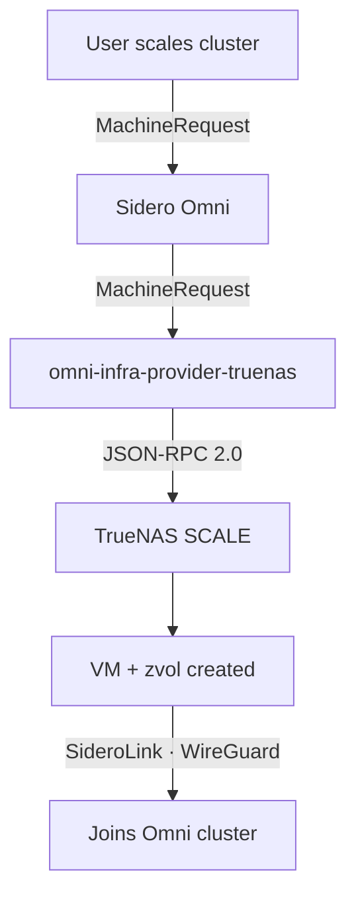
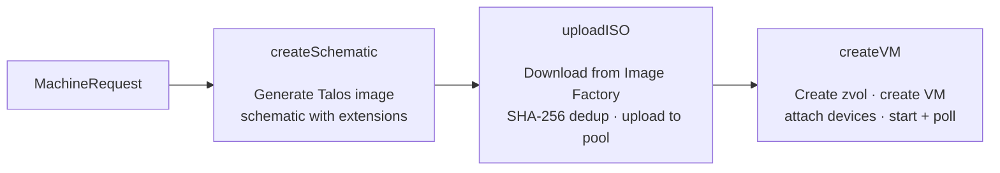

<!-- omni-infra-provider-truenas — TrueNAS SCALE infrastructure provider for Sidero Omni -->
<!-- SPDX-License-Identifier: MIT -->
<!-- keywords: truenas, omni, talos, kubernetes, infrastructure-provider, vm, zfs, json-rpc -->
<!-- category: infrastructure, kubernetes, virtualization -->
<!-- language: go -->

<div align="center">


<br />
<br />

**Automatically provision and manage Talos Linux VMs on TrueNAS SCALE through [Sidero Omni](https://omni.siderolabs.com/).**

[](https://github.com/bearbinary/omni-infra-provider-truenas/actions/workflows/ci.yaml)
[](https://github.com/bearbinary/omni-infra-provider-truenas/actions/workflows/release.yaml)
[](go.mod)
[](LICENSE)
[](https://github.com/bearbinary/omni-infra-provider-truenas/releases/latest)
[](https://ghcr.io/bearbinary/omni-infra-provider-truenas)
[](https://sonarcloud.io/summary/new_code?id=bearbinary_omni-infra-provider-truenas)

<br />

[Quick Start](#quick-start) ·
[Configuration](#configuration) ·
[Usage](#usage) ·
[Architecture](#architecture) ·
[Development](#development)

</div>

<br />

> [!IMPORTANT]
> **Requires TrueNAS SCALE 25.04+ (Fangtooth).** This provider uses the JSON-RPC 2.0 API exclusively. The legacy REST v2.0 API is **not supported**.

---

## Overview

This provider bridges [Sidero Omni](https://omni.siderolabs.com/) and [TrueNAS SCALE](https://www.truenas.com/truenas-scale/), enabling fully automated Kubernetes cluster provisioning on your own hardware. When Omni requests a machine, this provider creates a Talos Linux VM on TrueNAS — complete with ZFS-backed storage, network configuration, and automatic Omni enrollment.

### Key Features

- **Zero-touch VM lifecycle** — provision, start, stop, and destroy VMs automatically in response to Omni MachineRequests
- **Dual transport** — Unix socket (zero-auth, for TrueNAS apps) or WebSocket (API key, for remote hosts)
- **ZFS-native storage** — zvols for VM disks, automatic ISO caching with SHA-256 deduplication
- **Multi-arch support** — `amd64` and `arm64` VM images via [Talos Image Factory](https://factory.talos.dev/)
- **Flexible networking** — bridges, VLANs, or physical NICs
- **Startup health checks** — validates pool, NIC, and API connectivity before accepting work
- **Background cleanup** — automatically removes stale ISOs and orphan VMs/zvols
- **OpenTelemetry observability** — traces, metrics, and profiling (optional)

---

## How It Works



1. **Omni creates a MachineRequest** — user scales a cluster or creates a MachineSet
2. **Provider generates a Talos schematic** — defines the OS image with extensions (e.g., `qemu-guest-agent`)
3. **Provider downloads the Talos ISO** — from [Image Factory](https://factory.talos.dev/), cached on TrueNAS to avoid re-downloading
4. **Provider creates a VM** — zvol for disk, CDROM with ISO, NIC on your bridge, starts the VM
5. **VM boots Talos, joins Omni** — via SideroLink (outbound WireGuard tunnel)

When machines are removed, the provider stops the VM, deletes it, and cleans up the zvol.

---

## Transport

This provider communicates with TrueNAS via **JSON-RPC 2.0** — the same protocol used by TrueNAS's own CLI (`midclt`) and web UI.

Two transports are supported, auto-detected in priority order:

| Transport | When Used | Auth |
|---|---|---|
| **Unix socket** | Running as a TrueNAS app (socket mounted) | None required — trusted local process |
| **WebSocket** | Running remotely (k8s, Docker on another host) | API key required |

> The legacy REST v2.0 API (`/api/v2.0/`) is **not supported**. TrueNAS deprecated it in 25.04 and will remove it in 26.x.

---

## Quick Start

### Prerequisites

1. **TrueNAS SCALE 25.04+** — the JSON-RPC 2.0 API is required
2. **Omni instance** with an infrastructure provider service account
3. **ZFS pool** with available space
4. **Network interface** for VM traffic — a bridge (e.g., `br0`), VLAN (e.g., `vlan100`), or physical NIC

### Create the Omni Service Account

```bash
omnictl serviceaccount create --role=InfraProvider infra-provider:truenas
# Save the output — it contains OMNI_SERVICE_ACCOUNT_KEY
```

### Option 1: TrueNAS App (Recommended)

Deploy directly on your TrueNAS server. The middleware Unix socket is mounted automatically — **no API key needed**.

```yaml
# Paste into TrueNAS Apps > Discover > Install via YAML
services:
  omni-infra-provider-truenas:
    image: ghcr.io/bearbinary/omni-infra-provider-truenas:latest
    restart: unless-stopped
    volumes:
      - /var/run/middleware:/var/run/middleware:ro
    network_mode: host
    environment:
      OMNI_ENDPOINT: "https://omni.example.com"
      OMNI_SERVICE_ACCOUNT_KEY: "<your-key>"
      DEFAULT_POOL: "default"
      DEFAULT_NIC_ATTACH: "br0"
```

### Option 2: Kubernetes

```bash
# Edit the configmap and secret with your values
kubectl apply -k deploy/kubernetes/
```

See [`deploy/kubernetes/`](deploy/kubernetes/) for the full manifests.

### Option 3: Docker Compose (Remote)

For running on a separate host via WebSocket:

```bash
cp .env.example .env
# Fill in OMNI_ENDPOINT, OMNI_SERVICE_ACCOUNT_KEY, TRUENAS_HOST, TRUENAS_API_KEY
docker compose -f deploy/docker-compose.yaml up -d
```

---

## Configuration

All configuration is via environment variables. A `.env` file is loaded automatically if present.

### Required

| Variable | Description |
|---|---|
| `OMNI_ENDPOINT` | Omni instance URL (e.g., `https://omni.example.com`) |
| `OMNI_SERVICE_ACCOUNT_KEY` | Omni infra provider service account key |

### TrueNAS Connection

| Variable | Default | Description |
|---|---|---|
| `TRUENAS_HOST` | — | TrueNAS hostname (WebSocket transport only) |
| `TRUENAS_API_KEY` | — | TrueNAS API key (WebSocket transport only) |
| `TRUENAS_INSECURE_SKIP_VERIFY` | `true` | Skip TLS verification for self-signed certs |
| `TRUENAS_SOCKET_PATH` | `/var/run/middleware/middlewared.sock` | Override Unix socket path |

> Not required when running on TrueNAS with the Unix socket mounted.

### Provider Defaults

| Variable | Default | Description |
|---|---|---|
| `DEFAULT_POOL` | `default` | ZFS pool for VM zvols and ISO cache |
| `DEFAULT_NIC_ATTACH` | — | Network interface for VM NICs (bridge, VLAN, or physical) |
| `DEFAULT_BOOT_METHOD` | `UEFI` | VM boot method (`UEFI` or `BIOS`) |
| `CONCURRENCY` | `4` | Max parallel provision/deprovision workers |
| `LOG_LEVEL` | `info` | Log level: `debug`, `info`, `warn`, `error` |
| `TRUENAS_MAX_CONCURRENT_CALLS` | `8` | Max concurrent JSON-RPC calls to TrueNAS |

### Provider Identity (Optional)

| Variable | Default | Description |
|---|---|---|
| `PROVIDER_ID` | `truenas` | Provider ID registered with Omni |
| `PROVIDER_NAME` | `TrueNAS` | Display name in Omni UI |
| `PROVIDER_DESCRIPTION` | `TrueNAS SCALE infrastructure provider` | Description in Omni UI |
| `OMNI_INSECURE_SKIP_VERIFY` | `false` | Skip TLS verification for Omni connection |

### Observability (Optional)

| Variable | Description |
|---|---|
| `OTEL_EXPORTER_OTLP_ENDPOINT` | OpenTelemetry collector endpoint (e.g., `localhost:4317`) |
| `OTEL_EXPORTER_OTLP_INSECURE` | Use insecure gRPC to collector |
| `OTEL_SERVICE_NAME` | Override service name (default: `omni-infra-provider-truenas`) |
| `PYROSCOPE_URL` | Pyroscope endpoint for continuous profiling (e.g., `http://localhost:4040`) |

See [`deploy/observability/`](deploy/observability/) for a ready-to-use Prometheus + Tempo + Grafana stack.

### ISO Handling

Talos ISOs are downloaded automatically from [Image Factory](https://factory.talos.dev/) based on the schematic generated for each machine request. ISOs are cached on the TrueNAS filesystem at `<pool>/talos-iso/` and deduplicated by SHA-256 hash — the same image is never downloaded twice.

---

## Usage

Once the provider is running and connected to Omni, create MachineClasses to trigger VM provisioning.

### Via omnictl (CLI)

**Create a MachineClass:**

```bash
cat <<'EOF' | omnictl apply -f -
metadata:
  namespace: default
  type: MachineClasses.omni.sidero.dev
  id: truenas-small
spec:
  autoprovision:
    providerid: truenas
    grpcendpoint: ""
    icon: ""
    configpatch: |
      cpus: 2
      memory: 4096
      disk_size: 40
EOF
```

**With custom pool and NIC (overrides provider defaults):**

```bash
cat <<'EOF' | omnictl apply -f -
metadata:
  namespace: default
  type: MachineClasses.omni.sidero.dev
  id: truenas-large
spec:
  autoprovision:
    providerid: truenas
    grpcendpoint: ""
    icon: ""
    configpatch: |
      cpus: 8
      memory: 16384
      disk_size: 200
      pool: "fast-nvme"
      nic_attach: "vlan100"
EOF
```

Assign the MachineClass when creating a cluster or MachineSet in Omni.

### Via Omni Web UI

1. Navigate to **Clusters > Create Cluster** (or edit an existing cluster)
2. In the machine selection step, choose **Auto Provision** and select the `truenas` provider
3. Configure CPUs, Memory, Disk Size, and optional overrides
4. Set the desired replica count and create the cluster

Fields left blank use the provider's defaults (`DEFAULT_POOL`, `DEFAULT_NIC_ATTACH`, etc.).

### MachineClass Config Reference

These fields go in the MachineClass `configpatch` (CLI) or the provider config form (UI):

| Field | Type | Required | Default | Description |
|---|---|---|---|---|
| `cpus` | int | Yes | `2` | Virtual CPUs (min: 1) |
| `memory` | int | Yes | `4096` | Memory in MiB (min: 1024) |
| `disk_size` | int | Yes | `40` | Root disk in GiB (min: 10) |
| `pool` | string | No | `DEFAULT_POOL` | ZFS pool for zvols and ISOs |
| `nic_attach` | string | No | `DEFAULT_NIC_ATTACH` | Bridge, VLAN, or physical interface |
| `boot_method` | string | No | `UEFI` | `UEFI` or `BIOS` |
| `architecture` | string | No | `amd64` | `amd64` or `arm64` |
| `extensions` | list | No | — | Additional Talos extensions (merged with defaults) |

### Recommended MachineClasses

| Class | CPUs | Memory | Disk | Use Case |
|---|---|---|---|---|
| `truenas-control-plane` | 2 | 2048 MiB | 10 GiB | Control plane (etcd + API server) |
| `truenas-worker` | 4 | 8192 MiB | 100 GiB | Workers (application workloads) |

> **Note:** Talos requires a minimum of 2 GiB RAM for control plane nodes. Control plane disks only need ~10 GiB (OS + etcd). Workers need more disk for container images.

### Talos System Extensions

Every VM automatically includes these extensions:

- `siderolabs/qemu-guest-agent` — hypervisor-to-guest communication
- `siderolabs/nfs-utils` — NFS client support
- `siderolabs/util-linux-tools` — mount/block device operations

Add more via the `extensions` field in MachineClass config:

```yaml
extensions:
  - "siderolabs/iscsi-tools"
```

---

## Architecture

```
cmd/omni-infra-provider-truenas/
├── main.go                     # Entry point, env config, transport auto-detection
└── data/
    ├── schema.json             # MachineClass config schema (served to Omni UI)
    └── icon.svg                # Provider icon for Omni UI

internal/
├── client/                     # TrueNAS JSON-RPC 2.0 client
│   ├── transport.go            # Transport interface
│   ├── socket.go               # Unix socket transport (zero-auth)
│   ├── ws.go                   # WebSocket transport (API key auth)
│   ├── truenas.go              # Client constructor, auto-detection
│   ├── vm.go                   # VM CRUD operations
│   ├── device.go               # Device attachment (CDROM, DISK, NIC)
│   ├── storage.go              # ZFS storage operations (zvols, ISOs)
│   └── jsonrpc.go              # JSON-RPC 2.0 protocol implementation
├── provisioner/
│   ├── provisioner.go          # Provisioner struct, infra.Provisioner interface
│   ├── steps.go                # 3 provision steps (schematic → ISO → VM)
│   ├── deprovision.go          # VM teardown and cleanup
│   └── data.go                 # MachineClass config parsing
├── cleanup/
│   └── cleanup.go              # Background stale ISO / orphan VM cleanup
├── resources/
│   ├── machine.go              # COSI Machine typed resource
│   └── meta/meta.go            # Provider ID constant
└── telemetry/
    ├── telemetry.go            # OpenTelemetry + Pyroscope init
    └── metrics.go              # Custom metrics

deploy/
├── docker-compose.yaml         # Docker Compose for remote deployment
├── kubernetes/                 # Kustomize manifests
└── observability/              # Prometheus + Tempo + Grafana stack

api/specs/
├── specs.proto                 # Protobuf definition for Machine resource
└── specs.pb.go                 # Generated Go code
```

### Provision Flow



---

## Development

```bash
make build              # Build binary to _out/
make test               # Run unit tests
make test-v             # Verbose unit tests
make test-integration   # Integration tests (requires TrueNAS instance)
make test-e2e           # Full E2E tests (requires TrueNAS instance)
make lint               # Run linters
make image              # Build Docker image
make generate           # Regenerate protobuf from specs.proto
```

Integration and E2E tests require a real TrueNAS SCALE instance. See [`docs/testing.md`](docs/testing.md) for setup instructions.

For detailed system design, see [`docs/architecture.md`](docs/architecture.md). For common issues, see [`docs/troubleshooting.md`](docs/troubleshooting.md).

### Binary Releases

Multi-platform binaries are built automatically on every release:

- `linux/amd64`, `linux/arm64`
- `darwin/amd64`, `darwin/arm64`

Docker images are published to `ghcr.io/bearbinary/omni-infra-provider-truenas` with multi-arch support.

---

## Related Projects

- [Sidero Omni](https://github.com/siderolabs/omni) — SaaS Kubernetes management platform
- [Talos Linux](https://github.com/siderolabs/talos) — Immutable Kubernetes OS
- [TrueNAS SCALE](https://github.com/truenas/middleware) — Open-source storage and virtualization platform

---

## Contributing

We use an **issues-only** contribution model — no pull requests. Open an issue describing what you'd like, and optionally prototype in a fork. See [CONTRIBUTING.md](CONTRIBUTING.md) for details.

## License

MIT — see [LICENSE](LICENSE).

Built by [Bear Binary](https://github.com/bearbinary).
