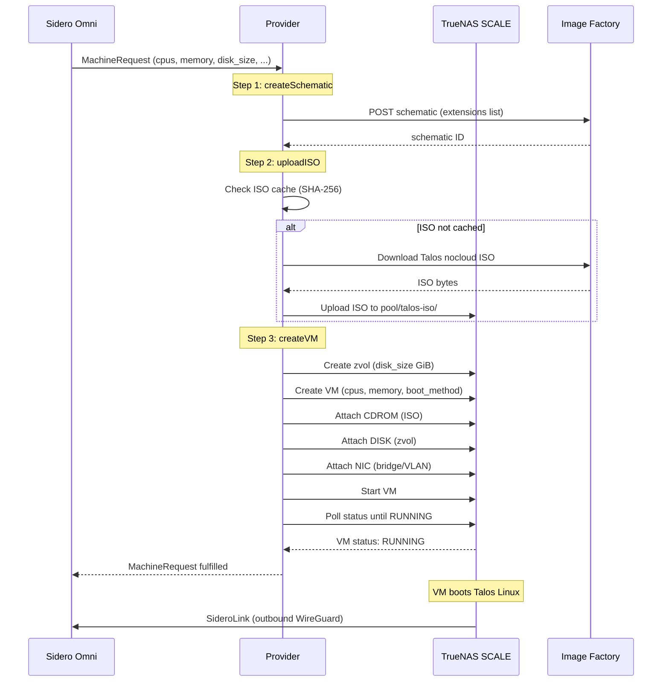
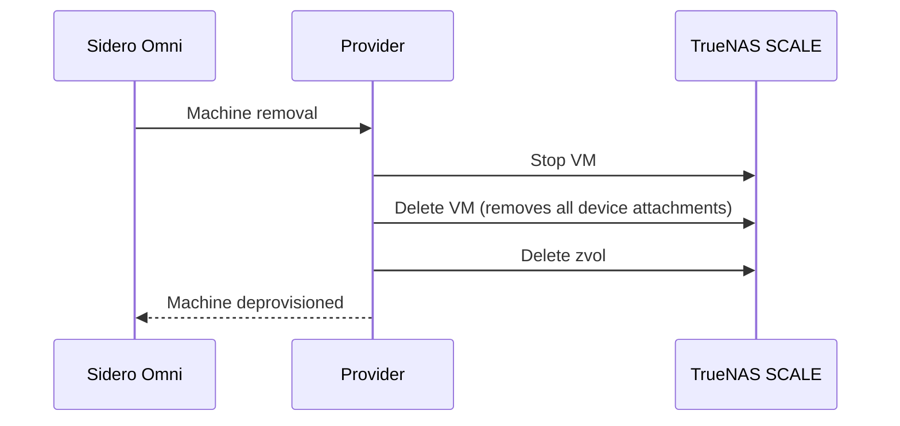
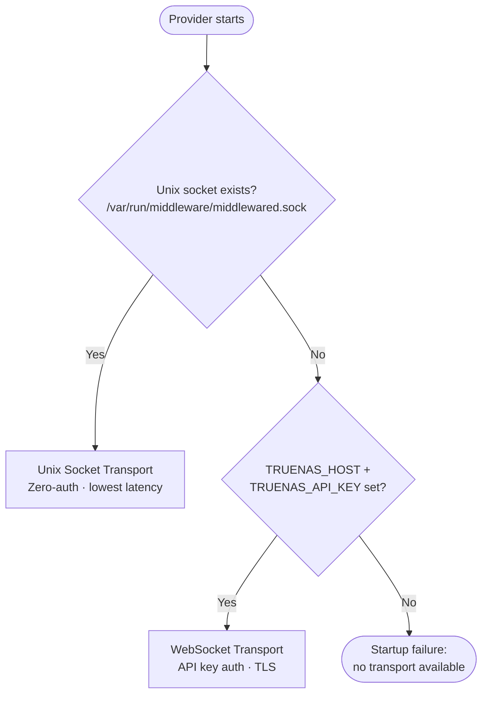
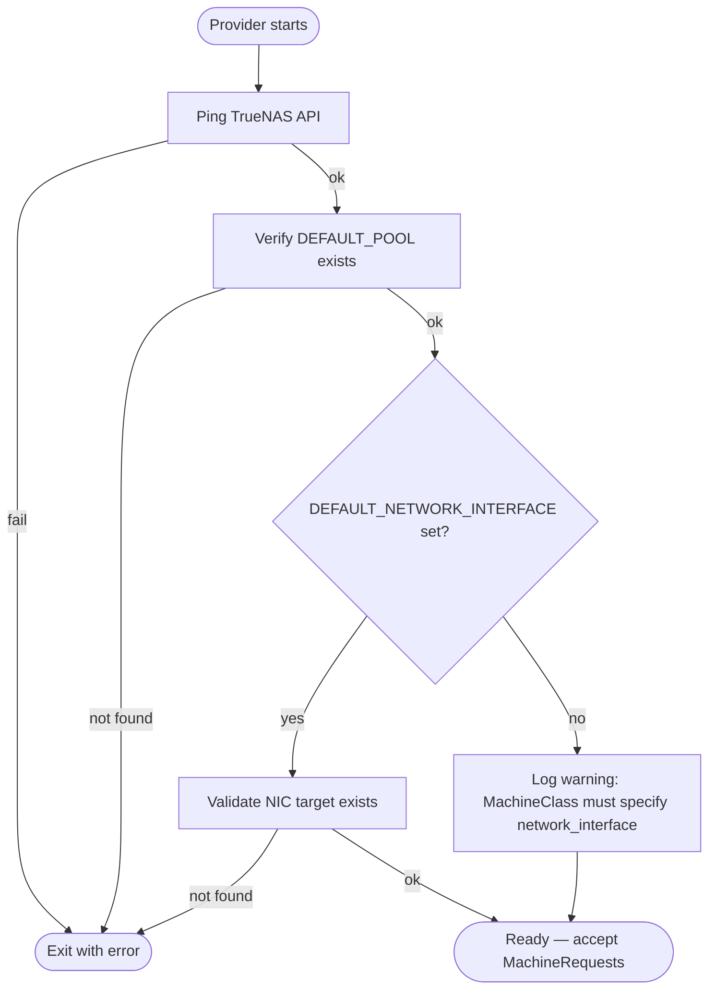

# Architecture

Detailed architecture of the Omni TrueNAS infrastructure provider.

## System Context

## Component Overview

## Provision Lifecycle

The full sequence from MachineRequest to a running, enrolled VM:

## Deprovision Lifecycle

## Transport Auto-Detection

## Startup Health Checks

Before accepting work from Omni, the provider validates its environment:

## Background Cleanup

The cleanup goroutine runs periodically to remove stale resources:

- **Stale ISOs** — ISOs in `<pool>/talos-iso/` that are no longer referenced by any active VM
- **Orphan VMs** — VMs with the provider's naming prefix that have no corresponding MachineRequest in Omni
- **Orphan zvols** — zvols associated with deleted VMs

## Data Flow

| Data | Source | Destination | Method |
|---|---|---|---|
| MachineRequest | Omni | Provider | gRPC (Omni SDK) |
| Image schematic | Provider | Image Factory | HTTPS POST |
| Talos ISO | Image Factory | TrueNAS pool | HTTPS GET + JSON-RPC upload |
| VM CRUD | Provider | TrueNAS | JSON-RPC 2.0 (socket or WebSocket) |
| SideroLink enrollment | Talos VM | Omni | Outbound WireGuard (port 443) |
| Health status | Provider | Omni | gRPC (Omni SDK) |
| Telemetry | Provider | OTel collector | gRPC (OTLP) |
