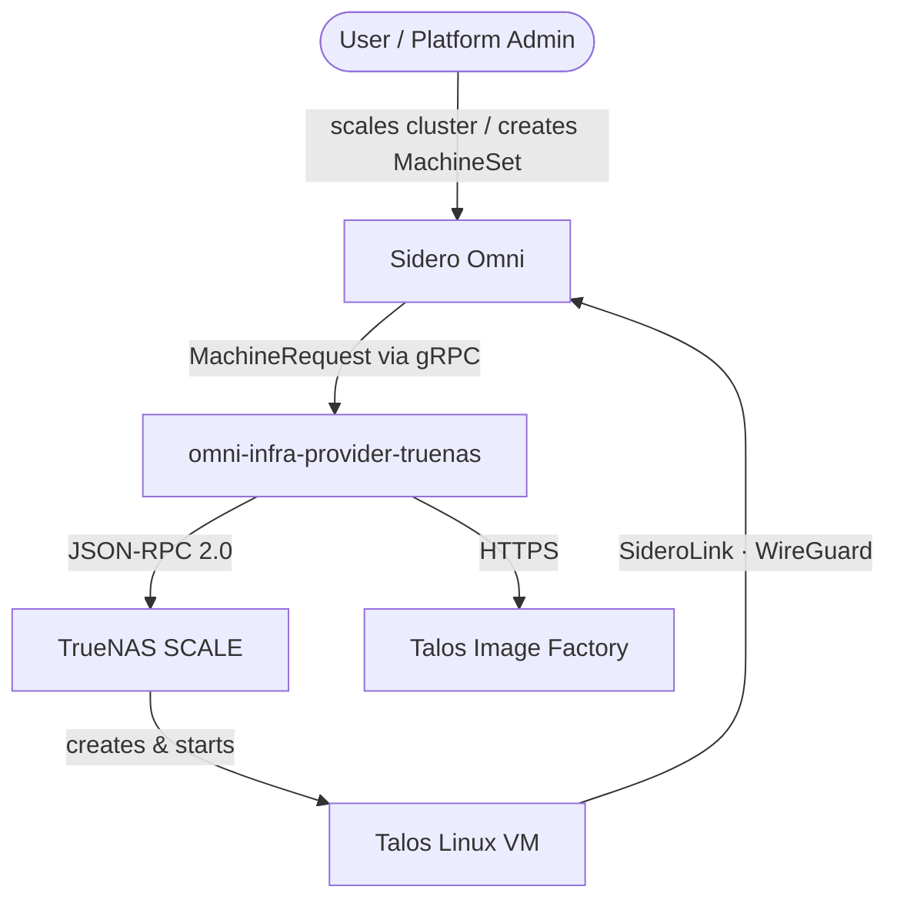
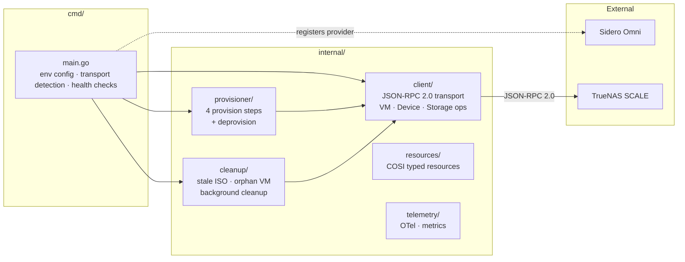
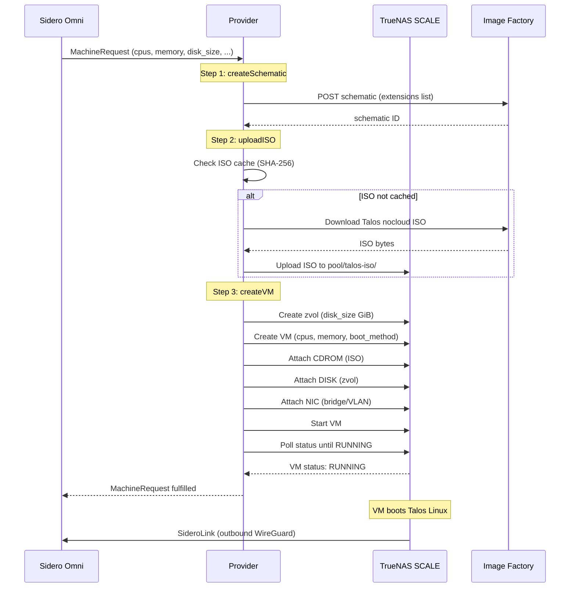
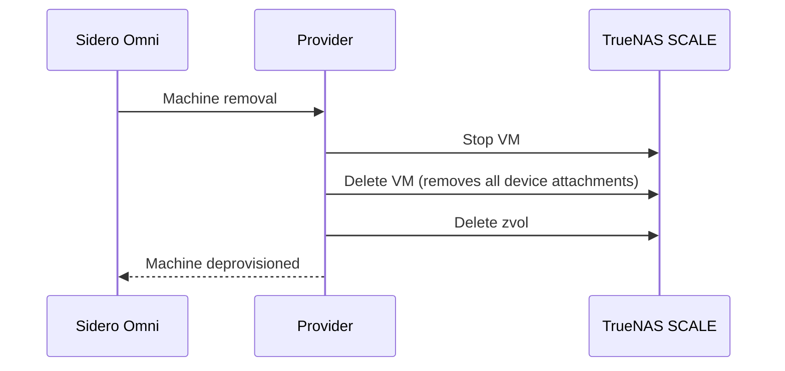
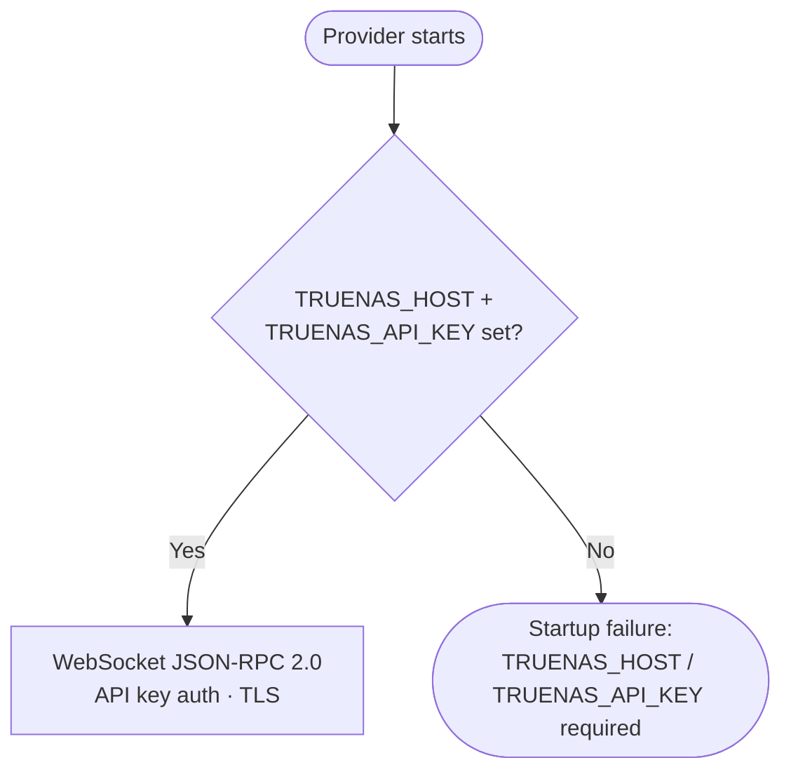
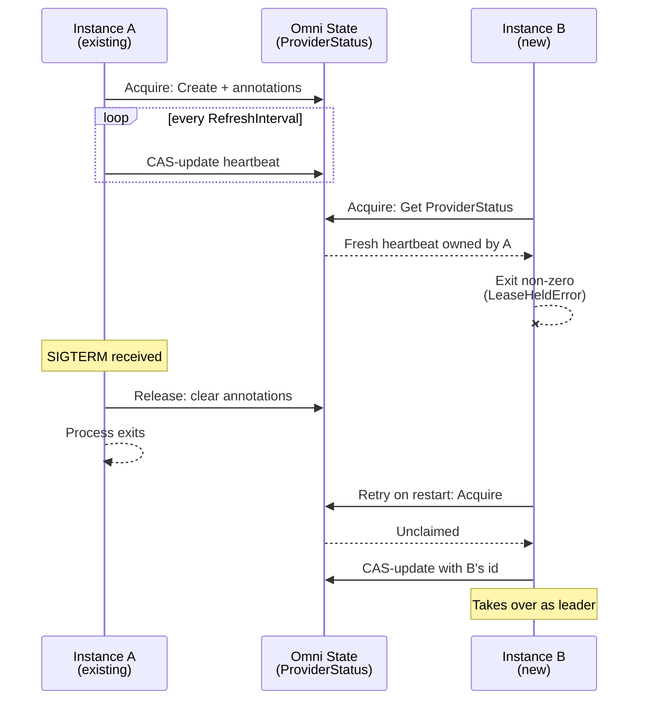

# Architecture

Detailed architecture of the Omni TrueNAS infrastructure provider.

## System Context

## Component Overview

## Provision Lifecycle

The full sequence from MachineRequest to a running, enrolled VM:

## Deprovision Lifecycle

## Transport

TrueNAS 25.10 (Goldeye) requires authentication on every JSON-RPC call — including local Unix socket connections. The Unix socket transport was removed in v0.14.0 because there is no longer a zero-auth path. When running as a TrueNAS app, set `TRUENAS_HOST=localhost` and `TRUENAS_INSECURE_SKIP_VERIFY=true`.

## Startup Health Checks

Before accepting work from Omni, the provider validates its environment:

## Singleton Enforcement

The provider is stateless and the Omni SDK does not elect a leader across
instances with the same `PROVIDER_ID` — every process that registers sees
every `MachineRequest` and would race on VM/zvol/ISO operations. To prevent
this, the provider claims a lease on the `infra.ProviderStatus` resource via
two metadata annotations:

- `bearbinary.com/singleton-instance-id` — UUID generated per process start
- `bearbinary.com/singleton-heartbeat` — RFC3339 timestamp refreshed on a
  configurable interval (default 15s)

These annotations survive the SDK's own `ProviderStatus` update because the
SDK only rewrites the `.Value` field of the spec, leaving metadata alone.

If the current leader is killed ungracefully (`kill -9`), its heartbeat goes
stale after `PROVIDER_SINGLETON_STALE_AFTER` (default 45s). The next instance
that tries to acquire sees the stale heartbeat and takes over.

The feature is on by default and can be disabled via
`PROVIDER_SINGLETON_ENABLED=false` for debugging or advanced sharding setups.

## Background Cleanup

The cleanup goroutine runs periodically to remove stale resources:

- **Stale ISOs** — ISOs in `<pool>/talos-iso/` that are no longer referenced by any active VM
- **Orphan VMs** — VMs with the provider's naming prefix that have no corresponding MachineRequest in Omni
- **Orphan zvols** — zvols associated with deleted VMs

## Data Flow

| Data | Source | Destination | Method |
|---|---|---|---|
| MachineRequest | Omni | Provider | gRPC (Omni SDK) |
| Image schematic | Provider | Image Factory | HTTPS POST |
| Talos ISO | Image Factory | TrueNAS pool | HTTPS GET + JSON-RPC upload |
| VM CRUD | Provider | TrueNAS | JSON-RPC 2.0 (socket or WebSocket) |
| SideroLink enrollment | Talos VM | Omni | Outbound WireGuard (port 443) |
| Health status | Provider | Omni | gRPC (Omni SDK) |
| Telemetry | Provider | OTel collector | gRPC (OTLP) |
