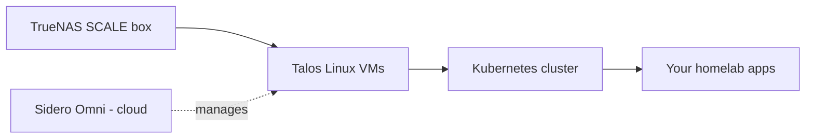
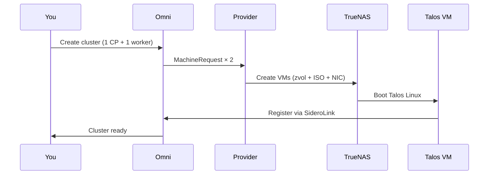

**TL;DR — You can run a real, multi-node Kubernetes cluster on your TrueNAS SCALE NAS without buying a separate hypervisor, without abandoning ZFS, and without giving up on managed cluster tooling. The path: Sidero Omni manages the cluster, Talos Linux runs inside each VM, and a small open-source provider I maintain — [`omni-infra-provider-truenas`](https://github.com/bearbinary/omni-infra-provider-truenas) — wires the two together so VMs appear, join, and disappear on demand.**

I'm Zac Clifton. I built this provider after TrueNAS dropped its built-in Kubernetes support and I needed my homelab cluster back. If you want the story of *why and how I built it*, that's [TrueNAS killed Kubernetes — so I brought it back](https://dev.to/cliftonz/truenas-killed-kubernetes-so-i-brought-it-back-4n7h). **This post is the canonical how-to** — start to running cluster, no narrative detour.

A companion YouTube walkthrough is up at *[Self-hosted Kubernetes on a TrueNAS box, start to finish](#)* — same path, on my actual rack, if you'd rather watch.

---

## Who this guide is for

- You own (or are buying) a TrueNAS SCALE 25.04+ ("Fangtooth") box with at least 4 cores and 16 GB of RAM to spare.
- You want **Kubernetes**, not the built-in TrueNAS Docker apps. You've outgrown them, or you want skills that transfer.
- You don't want to install Proxmox or ESXi alongside TrueNAS just to host VMs. One machine, one OS.
- You're comfortable in a terminal. Nothing exotic — `kubectl`, `omnictl`, copy-paste YAML.

If that's you, this guide takes you from "NAS in a closet" to "real cluster running real workloads" in about an evening.

---

## Three viable paths (and which one this is)

| Path | What it is | When it's right |
|---|---|---|
| **TrueNAS Apps (Docker-based)** | The catalog built into TrueNAS 25.04+ | A handful of containers, single-host, never want to think about it |
| **Proxmox + Talos + Omni** | Separate hypervisor host, VMs on Proxmox, K8s on top | Willing to run two machines (or split one), want maximum hypervisor flexibility |
| **TrueNAS + Talos + Omni (this guide)** | TrueNAS hosts the VMs directly, K8s on top | One box, real multi-node cluster, ZFS-native storage, full Omni feature set |

The third path is the one nobody had documented end-to-end, and it fits the majority of "I have a NAS and want a real cluster" situations. You keep TrueNAS as the system of record for storage, you don't pay for a second machine, and you get a managed control plane via Omni's free tier.

The tradeoff worth naming up front: your NAS's CPU and RAM are shared between file-serving and Kubernetes nodes. Over-provision and your file shares slow down. Sizing in the next section.

---

## What you'll have at the end



- **A multi-node Kubernetes cluster** running as Talos VMs on your NAS.
- **An Omni dashboard** to upgrade, scale, and manage the cluster without ever SSH-ing in (Talos has no SSH, by design).
- **`kubectl` working from your laptop**, so you can deploy anything Kubernetes can run — Home Assistant, Jellyfin, Grafana, Argo CD, Nextcloud, you name it.

---

## The three pieces you need

| Piece | Job |
|---|---|
| **[TrueNAS SCALE 25.04+](https://www.truenas.com/truenas-scale/)** | Hosts the VMs. Provides ZFS storage for VM disks and (optionally) your cluster's persistent volumes. |
| **[Sidero Omni](https://omni.siderolabs.com/)** | The Kubernetes management platform. Creates clusters, schedules upgrades, hands you a kubeconfig. Free tier covers homelab use. |
| **[Talos Linux](https://www.talos.dev/)** | A minimal, immutable Linux that boots into Kubernetes and nothing else. No SSH, no shell, no package manager. You'll like it more than you expect to. |

And the glue I maintain: [`omni-infra-provider-truenas`](https://github.com/bearbinary/omni-infra-provider-truenas). It's an Omni infrastructure provider that listens for `MachineRequest` resources and creates/destroys the corresponding Talos VMs on your TrueNAS box via TrueNAS's JSON-RPC API. MIT licensed.

> **Talos vs Ubuntu**: I get asked this constantly. Talos is immutable — you can't apt-install anything, you can't shell in, you can't drift from config. Sounds restrictive; it's the feature. Cluster nodes become reproducible artifacts you replace rather than maintain. Two minutes after a node misbehaves, it's gone and a new one is up. That mental model is most of why I trust this stack at home.

---

## Hardware sizing — how to think about it

Your NAS has to do its day job (file serving, snapshots, scrubs) **plus** host the VMs. Plan for:

| Goal | CPU (total) | RAM (total) | Free disk on pool |
|---|---|---|---|
| Just try it (1 CP + 1 worker) | 4+ cores | 16+ GB | 50+ GB |
| Comfortable home cluster (1 CP + 2 workers) | 8+ cores | 32+ GB | 100+ GB |
| Production-ish (3 CP + 3 workers, HA) | 16+ cores | 64+ GB | 500+ GB |

Subtract ~8 GB RAM for TrueNAS itself before counting VM allocations.

Two non-obvious traps worth naming up front:

1. **HDD pools and etcd don't get along.** etcd assumes sub-10 ms fsync. Spinning disks under load see 50–200 ms. If your pool is HDDs without an NVMe SLOG, plan to either add a SLOG or apply the heartbeat/election timeout patch from the [sizing guide](https://github.com/bearbinary/omni-infra-provider-truenas/blob/main/docs/sizing.md). Skip this and your cluster will look intermittently broken with no obvious cause.
2. **The 20 GiB root disk floor is real.** Talos pulls every control-plane image — kube-apiserver, etcd, scheduler, controller-manager, CNI, CoreDNS — during bootstrap. A 10 GiB root disk fills mid-install and etcd never comes up. The provider enforces 20 GiB minimum on purpose.

---

## The walkthrough

This is the condensed version. The exhaustive doc with every screenshot lives at [getting-started.md](https://github.com/bearbinary/omni-infra-provider-truenas/blob/main/docs/getting-started.md) in the repo — point this guide at that when you're ready to actually do it.

### Step 1 — Get an Omni account and the `omnictl` CLI

Sign up at [omni.siderolabs.com](https://omni.siderolabs.com/). Install `omnictl`:

```bash
# macOS
brew install siderolabs/tap/omnictl

# Linux
curl -sL https://omni.siderolabs.com/omnictl/latest/omnictl-linux-amd64 -o /usr/local/bin/omnictl
chmod +x /usr/local/bin/omnictl
```

Authenticate:

```bash
omnictl config url https://<your-omni-instance>.omni.siderolabs.com
```

Create the service account the provider will use:

```bash
omnictl serviceaccount create --role=InfraProvider infra-provider:truenas
```

**Copy the key it prints. It's shown once.** That string becomes `OMNI_SERVICE_ACCOUNT_KEY` in step 3.

### Step 2 — Prep TrueNAS

Three things in the TrueNAS UI:

1. **Identify your ZFS pool** (Storage). Note the top-level name — `tank`, `data`, `default`, whatever. VM disks land here.
2. **Create a network bridge** (Network > Interfaces > Add → Type: Bridge → Bridge Members: your primary NIC → DHCP: on). This briefly drops your NAS off the network while the IP moves onto the bridge. Name it `br0`. VMs share this bridge.
3. **Create a dedicated API key user.** Don't use root. Create `omni-provider` with password disabled, add it to the `builtin_administrators` group, then create an API key for that user. The reasoning (a TrueNAS quirk involving `SYS_ADMIN` and HTTP upload) is in the [TrueNAS setup guide](https://github.com/bearbinary/omni-infra-provider-truenas/blob/main/docs/truenas-setup.md#5-api-key).

### Step 3 — Install the provider

In TrueNAS: **Apps > Discover Apps > Custom App** (install via Docker Compose). Paste:

```yaml
services:
  omni-infra-provider-truenas:
    image: ghcr.io/bearbinary/omni-infra-provider-truenas:latest
    restart: unless-stopped
    network_mode: host
    environment:
      OMNI_ENDPOINT: "https://<your-omni-instance>.omni.siderolabs.com"
      OMNI_SERVICE_ACCOUNT_KEY: "<paste from step 1>"
      TRUENAS_HOST: "localhost"
      TRUENAS_API_KEY: "<paste from step 2>"
      TRUENAS_INSECURE_SKIP_VERIFY: "true"
      DEFAULT_POOL: "tank"
      DEFAULT_NETWORK_INTERFACE: "br0"
```

The provider is also available on the TrueNAS apps community catalog. Either path works.

Check the logs. You want to see:

```
"startup checks passed" transport=websocket pool=tank network_interface=br0
"starting TrueNAS infra provider" provider_id=truenas omni_endpoint=...
```

Both lines = green light. If you see a `pool not found` or `network interface target not found`, your pool or bridge name is wrong (case-sensitive).

### Step 4 — Define MachineClasses

A MachineClass is the template Omni uses to ask the provider for a particular flavor of VM. You'll have two: a small one for control planes, a larger one for workers.

```bash
cat <<'EOF' | omnictl apply -f -
metadata:
  namespace: default
  type: MachineClasses.omni.sidero.dev
  id: truenas-small
spec:
  autoprovision:
    providerid: truenas
    grpcendpoint: ""
    icon: ""
    configpatch: |
      cpus: 2
      memory: 2048
      disk_size: 20
EOF
```

```bash
cat <<'EOF' | omnictl apply -f -
metadata:
  namespace: default
  type: MachineClasses.omni.sidero.dev
  id: truenas-worker
spec:
  autoprovision:
    providerid: truenas
    grpcendpoint: ""
    icon: ""
    configpatch: |
      cpus: 2
      memory: 4096
      disk_size: 40
      storage_disk_size: 100
EOF
```

`storage_disk_size: 100` attaches a 100 GiB data disk to each worker for Longhorn (more on storage below).

> **Heads up on the small control plane.** 2 vCPU / 2 GB is fine for a *raw* cluster. If you'll install Crossplane, Rancher/Fleet, Argo CD with many ApplicationSets, or Prometheus Operator at full scrape, bump to **4 vCPU / 4 GB** *before* you create the cluster. The apiserver swaps under load otherwise and the cluster looks intermittently slow.

### Step 5 — Create the cluster in Omni

In the Omni web UI:

1. **Clusters > Create Cluster**.
2. Name it (`homelab`).
3. Control plane: **Auto Provision**, provider `truenas`, MachineClass `truenas-small`, replicas `1` (or `3` for HA).
4. Workers: **Auto Provision**, provider `truenas`, MachineClass `truenas-worker`, replicas `1` or more.
5. Before clicking Create, see step 7 if you want `kubectl top` and HPAs.
6. Click **Create**.

Now watch two windows:

- **TrueNAS UI > Virtualization** — you'll see VMs named `omni-<random>` appear.
- **Omni UI > Machines** — those VMs register as they boot.

2–5 minutes per node.



### Step 6 — Get a kubeconfig and deploy something

```bash
mkdir -p ~/.kube
omnictl kubeconfig -c homelab > ~/.kube/config
kubectl get nodes
```

You should see your nodes Ready. Deploy nginx to prove it works:

```bash
kubectl create deployment hello --image=nginx
kubectl expose deployment hello --port=80 --type=NodePort
kubectl get service hello   # note the NodePort
kubectl get nodes -o wide   # grab any node IP
```

Open `http://<node-ip>:<nodeport>` in a browser. nginx welcome page. Done.

### Step 7 — Wire up metrics-server (do this at cluster creation)

`kubectl top` and HPAs need metrics-server. On Talos that's slightly more involved than a one-liner because the kubelet's serving cert is self-signed. The cleanest path is to bootstrap it at cluster creation. In the Omni cluster create form, add to **Cluster Config Patches**:

```yaml
machine:
  kubelet:
    extraArgs:
      rotate-server-certificates: true
```

And under **Extra Manifests**, two URLs (one per line):

```
https://raw.githubusercontent.com/alex1989hu/kubelet-serving-cert-approver/main/deploy/standalone-install.yaml
https://github.com/kubernetes-sigs/metrics-server/releases/latest/download/components.yaml
```

If you're past cluster creation, the retroactive path is in the [getting-started doc](https://github.com/bearbinary/omni-infra-provider-truenas/blob/main/docs/getting-started.md#step-7-enable-metrics-server-optional).

---

## Storage: what to do about persistent volumes

The question I get most after "did it work?" — so here's the short version of my opinion.

| Option | When I reach for it |
|---|---|
| **Longhorn** (recommended default) | You want everything inside the cluster, block storage performance, and a CNCF-grade project. Needs the data disk on each worker (`storage_disk_size`). |
| **democratic-csi** (TrueNAS-native) | You want ZFS snapshots of every PVC, NFS or iSCSI off TrueNAS. Most battle-tested for "use the NAS as the storage". |
| **nfs-subdir-external-provisioner** | Honestly, don't. Loose permissions, weird failure modes, no real ownership story for cluster data. |

Full reasoning, install steps, tradeoffs: [storage guide](https://github.com/bearbinary/omni-infra-provider-truenas/blob/main/docs/storage.md).

---

## Common pitfalls (the ones that bite real users)

1. **Using the `root` user's API key.** Works, but you lose audit separation and can't revoke without consequences. Dedicated user (step 2).
2. **`pool: tank/k8s` in MachineClass.** `pool` is the top-level pool name only. Use `dataset_prefix: k8s` for nesting.
3. **Bridge MTU mismatch.** If you set `mtu: 9000` on additional NICs, the bridge and the switch ports must match. Otherwise expect mysterious dropped packets.
4. **Allocating more RAM than the host can lock.** Without `min_memory`, TrueNAS reserves the full `memory` at VM start. If the host can't lock it, the VM fails with ENOMEM. v0.16.1 makes this fail loud at the schema boundary, but it's still worth knowing.
5. **HDD-only pool, no SLOG, default etcd timeouts.** See the sizing warning above. Apply the timeout patch or expect intermittent leader changes.

---

## What's next

Once you've got a working cluster:

- **Backups**: Velero with a Restic backend pointing at NFS or S3-compatible storage. [Backup guide](https://github.com/bearbinary/omni-infra-provider-truenas/blob/main/docs/backup.md) has my actual config.
- **Networking polish**: MetalLB for LoadBalancer services, ExternalDNS if you run your own DNS. [Networking guide](https://github.com/bearbinary/omni-infra-provider-truenas/blob/main/docs/networking.md).
- **Apps to actually run**: Home Assistant, Jellyfin, Grafana + Prometheus, Nextcloud, Pi-hole. Helm charts exist for all of them.
- **Scale the cluster**: bump worker replicas in Omni — the provider creates new VMs automatically and the new nodes join in a couple of minutes.

---

## FAQ

### Is this a real cluster or a toy cluster?

Real. Same Talos, same Omni, same Kubernetes APIs you'd get on bare metal or a cloud provider. The only difference: your nodes are VMs hosted on your NAS instead of physical hardware or cloud VMs.

### Do I need to pay for Omni?

Omni has a free tier that covers personal and homelab use. You can also self-host Omni (it's a Go binary) if you'd rather not depend on Sidero's cloud. The provider works with both.

### Can I run this without an internet connection?

No. Outbound HTTPS is required: VMs need to fetch the Talos image from Sidero's Image Factory on first boot, then maintain a SideroLink (WireGuard) tunnel to Omni on port 443. No inbound ports need to be open.

### Does this conflict with the built-in TrueNAS apps catalog?

No. They're separate. You can run both, but you probably don't want to — they'll fight for resources and serve different goals. Pick one.

### Can I SSH into the Talos nodes?

No, by design. Talos has no SSH and no shell. You manage nodes via `kubectl`, `talosctl`, and the Omni UI. This is a security feature; there's nothing to compromise.

### What happens when TrueNAS reboots?

VMs stop with the host and start with it. The provider auto-reconnects to Omni. Kubernetes workloads restart automatically. I've rebooted my host plenty of times without losing a cluster.

### Can I mix VM nodes with bare-metal nodes?

Yes. Omni manages both in the same cluster. Use this provider for VM-based control planes and add physical machines as workers, or any combination.

### Is the provider production-ready?

For homelab and small-team use, yes — I run it as my daily driver. The recent v0.16.1 line shipped a host-OOM safety check, a SAST sweep, and 42 cassette-based integration tests that run in CI without TrueNAS hardware. That said: it's MIT-licensed open source maintained by one person (me), under an issues-only contribution model. Use accordingly.

---

## Try it

- **Repo + install**: [github.com/bearbinary/omni-infra-provider-truenas](https://github.com/bearbinary/omni-infra-provider-truenas)
- **Origin story** (why it exists): [TrueNAS killed Kubernetes — so I brought it back](https://dev.to/cliftonz/truenas-killed-kubernetes-so-i-brought-it-back-4n7h)
- **Companion video**: [Self-hosted Kubernetes on a TrueNAS box, start to finish](#) on YouTube
- **Issues / questions**: file an issue on the repo. Issues-only model — no PRs accepted — but I respond.

If you build something on top of this, I'd genuinely like to know. Find me on [LinkedIn](#) or open an issue with a screenshot.

---

**About the author**: Zac Clifton is an infrastructure engineer building tools for self-hosters and small teams. He maintains `omni-infra-provider-truenas` and writes about pragmatic homelab Kubernetes. Subscribe on [YouTube](#) for monthly deep-dives on Talos, Omni, TrueNAS, and the parts of self-hosted infra nobody else is writing about.
