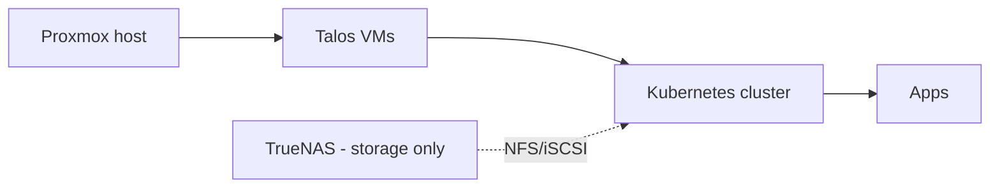
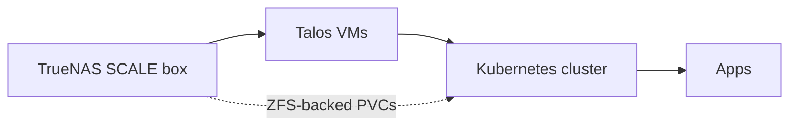

**TL;DR — Running Kubernetes on Proxmox is the well-trodden path. Running it directly on TrueNAS SCALE (via the [provider I maintain](https://github.com/bearbinary/omni-infra-provider-truenas)) is the path that didn't exist until recently. Both are valid. They optimize for different things. This post tells you which one is right for your homelab.**

I'm Zac Clifton. I run Talos + Omni on a single TrueNAS SCALE 25.10 box. Before that I ran it on Proxmox with TrueNAS as a storage-only neighbor. I have opinions about both. Here they are, named honestly.

---

## The two architectures, in one diagram each

**Proxmox + TrueNAS (separate machines or two VMs on one host):**

**TrueNAS-only (this provider):**

The core difference: in the Proxmox setup, TrueNAS is a storage neighbor. In the TrueNAS-only setup, TrueNAS *is* the hypervisor.

---

## The tradeoff axes

### 1. Hardware count

**Proxmox + TrueNAS**: Two machines, or one machine running both hypervisors as nested setups (which I don't recommend — it's a debugging nightmare). Real-world deployments are usually two boxes: a beefy mini-PC running Proxmox, a NAS running TrueNAS.

**TrueNAS-only**: One machine. The same box does file serving and VM hosting. Your power bill drops, your rack space drops, your "what do I do when one box dies" question becomes simpler.

**Verdict**: TrueNAS-only wins if hardware sprawl is a real cost (rent, power, space, partner-tolerance). Proxmox + TrueNAS wins if you have abundant hardware and want clean separation.

### 2. Hypervisor flexibility

**Proxmox**: Best-in-class hypervisor UX. PCI passthrough that works first try. LXC containers alongside VMs. Live migration between Proxmox nodes. GPU passthrough is mature.

**TrueNAS**: VM hosting is a TrueNAS feature, not its purpose. The Virtualization UI is functional but not as flexible as Proxmox's. PCI passthrough exists but is less battle-tested. No live migration. GPU passthrough is possible but requires manual work.

**Verdict**: Proxmox wins decisively on hypervisor capability. TrueNAS wins on "good enough for Talos VMs that never live-migrate anyway."

### 3. Storage architecture

**Proxmox + TrueNAS**: Two storage stacks. Proxmox has its own VM disks (local LVM, ZFS-on-Proxmox, or Ceph). TrueNAS has its own ZFS for files, NFS shares, etc. K8s persistent volumes typically come off TrueNAS via NFS or iSCSI. This is fine but means two systems to manage, two snapshot policies, two backup stories.

**TrueNAS-only**: One storage stack. VM disks are ZFS zvols on the same pool as your file shares. K8s persistent volumes via Longhorn (in-cluster data disks) or democratic-csi (ZFS-native PVCs with snapshots). One snapshot policy. One backup story.

**Verdict**: TrueNAS-only wins on operational simplicity. Proxmox + TrueNAS wins if you want strict isolation between hypervisor storage and bulk storage.

### 4. Failure blast radius

**Proxmox + TrueNAS**: Two boxes. Proxmox dies → VMs die, cluster degrades, TrueNAS still serves your files. TrueNAS dies → file shares die, K8s persistent volumes go offline, cluster nodes (CPU/RAM) keep running but stateful workloads error out. Independent failure domains.

**TrueNAS-only**: One box. One reboot, one drive failure, one PSU. Everything goes at once.

**Verdict**: Proxmox + TrueNAS wins on resilience. TrueNAS-only wins on "one thing to worry about." For most homelabs, neither is HA anyway — you'll lose stuff either way during a power outage. Pick the model that fits the failure scenarios you actually care about.

### 5. Resource contention

**Proxmox + TrueNAS**: Each box does one job. No contention.

**TrueNAS-only**: Your NAS is doing file serving *and* hosting Kubernetes nodes. If you over-provision the VMs, your file shares slow down during heavy K8s workloads. Sizing matters more here.

**Verdict**: Proxmox + TrueNAS wins on isolation. TrueNAS-only requires you to size honestly — leave 8 GB RAM for TrueNAS itself, watch your CPU steal time. The good news: most homelab K8s workloads are bursty, not pegged.

### 6. Network topology

**Proxmox + TrueNAS**: K8s nodes and TrueNAS are on the same LAN (probably). NFS/iSCSI traffic crosses the LAN. Possibly a dedicated storage VLAN. You manage two sets of network interfaces.

**TrueNAS-only**: K8s nodes and TrueNAS share a bridge on the same physical NIC. Storage traffic between cluster and storage is essentially loopback — faster, no LAN congestion. One set of network interfaces to manage.

**Verdict**: TrueNAS-only wins on storage latency and simplicity. Proxmox + TrueNAS wins if you want strict network separation or already have a dedicated 10G storage network.

### 7. Cost

| Component | Proxmox + TrueNAS | TrueNAS-only |
|---|---|---|
| Hardware | 2 boxes | 1 box |
| Power | ~150–300W idle (both) | ~50–120W idle (one) |
| Licenses | Both free | Both free |
| Time to set up | Higher (two systems) | Lower (one system) |

**Verdict**: TrueNAS-only wins meaningfully on TCO.

### 8. "What about Proxmox's PVE Talos provider?"

There's an official Talos + Omni provider for Proxmox (Sidero's own). It's mature. If you're going Proxmox, that's the path — not manual k3s in Proxmox VMs.

This post compares the *full systems*, not the providers. PVE-provider + Proxmox is the apples-to-apples comparison against TrueNAS-provider + TrueNAS.

---

## The decision matrix

| Your situation | Recommendation |
|---|---|
| Already own a TrueNAS, no Proxmox box, one-machine homelab | **TrueNAS-only.** This is the path that didn't exist before, and it's why this provider exists. |
| Already own a Proxmox, separate TrueNAS for storage | **Stick with Proxmox.** Use Sidero's PVE provider, treat TrueNAS as a storage neighbor via NFS or democratic-csi. |
| Building from scratch, abundant hardware budget | **Proxmox + TrueNAS.** Cleaner separation, more hypervisor capability, independent failure domains. |
| Building from scratch, tight hardware/power/space budget | **TrueNAS-only.** One box, one bill, one thing to fix. |
| Want GPU passthrough or PCI device shenanigans | **Proxmox.** TrueNAS can do it but you'll spend the difference in setup time. |
| Want live migration | **Proxmox.** Not available on TrueNAS. |
| Care about ZFS as the single source of truth for *everything* (files + VM disks + PVCs) | **TrueNAS-only.** That's the whole pitch. |
| Already running k3s manually in TrueNAS VMs and wondering whether to switch | See the companion post: [Talos + Omni vs k3s on TrueNAS](https://dev.to/cliftonz/<m2-talos-vs-k3s-slug>) |

---

## What I actually run

I ran the Proxmox + TrueNAS split for about a year. I built the TrueNAS provider because the split felt like overkill for my actual workload — I wasn't using Proxmox's flexibility, I was just paying for it in hardware and complexity.

I've been running TrueNAS-only for several months now. Less to manage, less to power, faster storage path between cluster and PVCs (loopback bridge), and zero regrets so far. Resource contention has never bitten me — the workloads I run are bursty, and I sized the host honestly.

The case where I'd go back to Proxmox: GPU-heavy workloads (Plex transcoding with hardware acceleration, ML inference) where PCI passthrough quality matters. For everything else, TrueNAS-only is the right answer.

---

## Try the TrueNAS-only path

- **Provider repo + install**: [github.com/bearbinary/omni-infra-provider-truenas](https://github.com/bearbinary/omni-infra-provider-truenas)
- **Canonical install guide**: [Kubernetes on TrueNAS SCALE: the Talos + Omni Path](https://dev.to/cliftonz/<hero-post-slug>)
- **Companion YouTube walkthrough**: [TrueNAS vs Proxmox for homelab Kubernetes](#)

If you've run both and disagree with anything here, I want to hear it. Open an issue on the repo or find me on [LinkedIn](#).

---

**About the author**: Zac Clifton is an infrastructure engineer building tools for self-hosters and small teams. He maintains `omni-infra-provider-truenas` and writes about pragmatic homelab Kubernetes. Subscribe on [YouTube](#) for monthly deep-dives on Talos, Omni, TrueNAS, and the parts of self-hosted infra nobody else is writing about.
