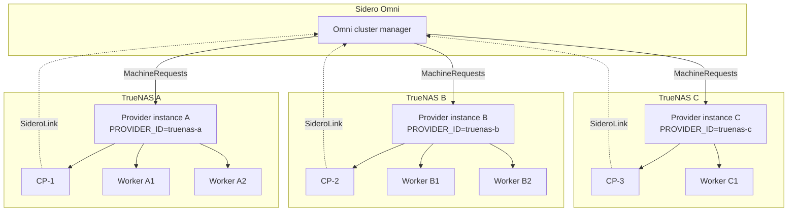

**TL;DR — A single Talos cluster can span multiple TrueNAS hosts today, with no provider code changes. The trick is running one `omni-infra-provider-truenas` instance per TrueNAS box (each with a unique `PROVIDER_ID`), defining per-host MachineClasses, and composing them into one cluster via separate MachineSets in Omni. This post walks through the setup, the failure-domain math, and the cases where multi-host is and isn't the right answer.**

I'm Zac Clifton. I maintain [`omni-infra-provider-truenas`](https://github.com/bearbinary/openni-infra-provider-truenas). This is the canonical writeup for the "I have two (or more) NAS boxes — can I run one cluster across them?" question.

For single-host setup, see [the hero install guide](https://dev.to/cliftonz/<hero-post-slug>). For sizing context, see [the sizing post](https://dev.to/cliftonz/<sizing-post-slug>). This post assumes you've successfully run a single-host cluster and are ready to scale out.

---

## Why span multiple NAS hosts

Three real reasons people do this. Pick the one that's yours before you start — the right architecture depends on it.

**1. Capacity.** You've outgrown one box. The cluster wants more CPU, more RAM, more disk than a single NAS chassis can give it. Add a second box, span the cluster, double your capacity.

**2. Failure independence for control plane HA.** You're running a 3-replica control plane and you want each replica on a different physical host. A single NAS failure can take down 1 of 3 CPs without losing etcd quorum. Single-host can't give you that.

**3. Storage separation.** You've got a primary NAS for files and a secondary NAS dedicated to compute. The cluster wants to run on the compute box but back PVCs (via NFS or iSCSI) to the file box. You need the provider on the compute side, and the cluster needs to reach both.

**Not a reason**: "more hardware is better." If one NAS has the capacity, the operational simplicity of one-box is genuinely valuable. Don't go multi-host because it sounds cooler.

---

## The mental model: one provider per host

The architecture in one sentence: **each TrueNAS host gets its own `omni-infra-provider-truenas` instance, each instance has a unique `PROVIDER_ID`, and Omni sees them as separate infrastructure pools that a single cluster can pull from.**



**Two key invariants**:

- **Each provider instance is independent.** The singleton lease lives in Omni state, keyed by `PROVIDER_ID`. Different IDs = different leases = no race conditions between instances.
- **MachineClasses bind to a specific provider.** `spec.autoprovision.providerid: truenas-a` only ever creates VMs on host A. The provider on host B ignores requests against that class.

The cluster is one cluster (one etcd, one apiserver pool, one network). The infrastructure underneath is N pools, one per host.

---

## Prerequisites

**Hardware (per host)**: same as the single-host minimums from the [hero install guide](https://dev.to/cliftonz/<hero-post-slug>), scaled to whatever you intend to run on that host. A host that's only going to run 2 workers needs less than the single-host comfortable minimum (32 GB RAM) — maybe 16 GB plus the 8 GB TrueNAS overhead.

**Network**:
- All TrueNAS hosts on the **same Layer 2 subnet**. Kubernetes networking assumes nodes can reach each other directly. Cross-subnet works but adds complexity (CNI routing, etcd timeout tuning, MetalLB segmentation) — skip it for the first multi-host setup.
- DHCP from your router (same range, no overlap with MetalLB).
- Bridge on each TrueNAS pointing at its primary NIC (same setup as single-host).

**Omni**:
- Cloud Omni or self-hosted — either works.
- One service account key. All provider instances use the same key but are distinguished by their `PROVIDER_ID`.

**The provider**:
- v0.15.0+ (the `PROVIDER_ID` requirement that makes multi-tenancy safe shipped in v0.15).
- Same image across all hosts. Different config per host.

---

## The setup walkthrough

### Step 1 — Pick `PROVIDER_ID` values

Choose unique, semantic identifiers per host. I use the host's role + location:

- `truenas-rack-a` (NAS in rack position A)
- `truenas-rack-b`
- `truenas-office` (the NAS in the office)
- `truenas-basement`

**Rules**:
- Lowercase, alphanumeric + dashes.
- Stable for the life of the host. Renaming a `PROVIDER_ID` strands all the VMs it created (Omni stops sending requests to the old ID, the new ID doesn't adopt the existing VMs).
- Don't include sensitive info — `PROVIDER_ID` appears in Omni logs and resource metadata.

### Step 2 — Deploy the provider on each host

Same Docker Compose YAML as the single-host setup, with `PROVIDER_ID` set per host. On TrueNAS A:

```yaml
services:
  omni-infra-provider-truenas:
    image: ghcr.io/bearbinary/omni-infra-provider-truenas:latest
    restart: unless-stopped
    network_mode: host
    environment:
      OMNI_ENDPOINT: "https://your-omni.omni.siderolabs.com"
      OMNI_SERVICE_ACCOUNT_KEY: "<same key on every host>"
      PROVIDER_ID: "truenas-rack-a"            # ← unique per host
      PROVIDER_NAME: "TrueNAS Rack A"          # ← human-friendly in Omni UI
      TRUENAS_HOST: "localhost"
      TRUENAS_API_KEY: "<api-key-for-this-host>"
      TRUENAS_INSECURE_SKIP_VERIFY: "true"
      DEFAULT_POOL: "tank"                     # ← per-host pool name
      DEFAULT_NETWORK_INTERFACE: "br0"
```

On TrueNAS B, change `PROVIDER_ID` to `truenas-rack-b`, `PROVIDER_NAME` to `TrueNAS Rack B`, and the TrueNAS API key to the one for that host.

Deploy on each host. Watch each host's logs — every instance should report `startup checks passed` and `starting TrueNAS infra provider` with *its own* provider ID.

In the Omni UI under **Infra Providers**, you should see one entry per host:

| ID | Status | Last Heartbeat |
|---|---|---|
| truenas-rack-a | Healthy | 5s ago |
| truenas-rack-b | Healthy | 7s ago |
| truenas-rack-c | Healthy | 4s ago |

If any of them shows stale or unhealthy, fix that before proceeding. Singleton lease misbehavior under a misconfigured `PROVIDER_ID` is the most common multi-host failure mode at startup.

### Step 3 — Per-host MachineClasses

Each host needs its own set of MachineClasses. Naming convention: `<role>-<host>`.

For control planes — small class, one per host you want a CP on:

```bash
cat <<'EOF' | omnictl apply -f -
metadata:
  namespace: default
  type: MachineClasses.omni.sidero.dev
  id: cp-rack-a
spec:
  autoprovision:
    providerid: truenas-rack-a               # ← bind to host A
    grpcendpoint: ""
    icon: ""
    configpatch: |
      cpus: 4
      memory: 4096
      disk_size: 40
EOF
```

Repeat for `cp-rack-b`, `cp-rack-c` with the appropriate `providerid`.

For workers — one class per host, sized to whatever that host can spare:

```bash
cat <<'EOF' | omnictl apply -f -
metadata:
  namespace: default
  type: MachineClasses.omni.sidero.dev
  id: worker-rack-a
spec:
  autoprovision:
    providerid: truenas-rack-a
    grpcendpoint: ""
    icon: ""
    configpatch: |
      cpus: 4
      memory: 8192
      disk_size: 40
      storage_disk_size: 100
EOF
```

Repeat for `worker-rack-b`, `worker-rack-c`.

You end up with N CP classes + N worker classes for N hosts. It's verbose. It's also explicit, which is the right tradeoff — you always know which host a VM will land on.

### Step 4 — Build the cluster with multiple MachineSets

In the Omni UI, create the cluster. The interesting part is the MachineSet section.

For an HA control plane spread across 3 hosts:

| MachineSet | Provider | MachineClass | Replicas |
|---|---|---|---|
| cp-a | truenas-rack-a | cp-rack-a | 1 |
| cp-b | truenas-rack-b | cp-rack-b | 1 |
| cp-c | truenas-rack-c | cp-rack-c | 1 |

For workers split across hosts:

| MachineSet | Provider | MachineClass | Replicas |
|---|---|---|---|
| workers-a | truenas-rack-a | worker-rack-a | 2 |
| workers-b | truenas-rack-b | worker-rack-b | 2 |
| workers-c | truenas-rack-c | worker-rack-c | 1 |

Click create. Each provider instance receives MachineRequests for its assigned MachineSets and creates the VMs on its TrueNAS. Omni assembles them into one cluster.

### Step 5 — Verify the spread

Once the cluster is up:

```bash
omnictl kubeconfig -c <cluster-name> > ~/.kube/config
kubectl get nodes -o wide
```

You should see nodes from each host. Cross-reference with each TrueNAS's Virtualization tab — the VMs should be where you intended. If they're not, the most common reason is a `providerid` typo in a MachineClass (the class bound to the wrong provider, so VMs landed on the wrong host).

---

## Where to put control planes

Three viable patterns, each with different failure tolerance.

### Pattern A — 1 CP on the biggest host, workers everywhere

```
Host A: 1 CP + N workers
Host B: M workers
Host C: K workers
```

**When this fits**: you have one beefy NAS and one or two smaller ones. The big host can hold the CP comfortably, the smaller ones contribute capacity but aren't asked to host critical state.

**Failure tolerance**: zero on the CP. Host A reboots → cluster API offline until it comes back. Workers on B and C keep running but can't be scheduled, scaled, or modified during the outage.

**Use this for**: capacity-constrained homelabs where you accept brief API outages during maintenance.

### Pattern B — 3 CPs spread across 3 hosts (HA)

```
Host A: 1 CP + workers
Host B: 1 CP + workers
Host C: 1 CP + workers
```

**When this fits**: you have 3+ hosts and you want real HA on the cluster API.

**Failure tolerance**: 1 host can fail. etcd has quorum of 2 out of 3. Apiserver keeps responding via the remaining CPs (use Talos VIP — see [networking post](https://dev.to/cliftonz/<networking-slug>)).

**The catch**: etcd is sensitive to inter-CP network latency. If your hosts are on the same Layer 2 subnet with sub-millisecond latency, you're fine. If they're cross-subnet or have higher latency (>5ms), expect intermittent leader elections under load.

**Use this for**: the moment you have 3 hosts and care about cluster API uptime during single-host maintenance.

### Pattern C — Dedicated CP host

```
Host A: 3 CPs (no workers)
Host B: workers only
Host C: workers only
```

**When this fits**: you have one host with reliable storage (NVMe + SLOG) and others without. Concentrating CPs on the good-storage host keeps etcd fast.

**Failure tolerance**: zero on CP. Host A dies → entire control plane gone. Worse than Pattern A in some ways — you've concentrated risk.

**Use this for**: rarely. The argument is "etcd latency consistency" but you give up failure independence. Pattern B is almost always better.

---

## Storage across hosts

Storage gets interesting when the cluster spans hosts. Three options scale differently.

### Longhorn — spans hosts naturally

Longhorn replicates volumes across worker data disks. Multi-host means **replicas can land on workers on different hosts**, which gives you real storage HA — a worker failure (or a whole host failure) doesn't lose data if you have ≥3 replicas spread across ≥3 hosts.

**Setup considerations**:
- Add `storage_disk_size` to every worker MachineClass on every host.
- Longhorn picks replica locations automatically — by default it spreads across nodes, which means across hosts when nodes are on different hosts.
- The Longhorn "data locality" feature can be tuned to prefer local replicas (faster reads), but the safety story relies on spread.

**This is the recommended path** for most multi-host setups. The failure-independence story is genuinely better than single-host.

### democratic-csi — pick *which* TrueNAS hosts the storage

democratic-csi talks to *one* TrueNAS host via its API. In a multi-host cluster you decide which host's TrueNAS hosts the PVCs. The other hosts' TrueNAS storage isn't involved in the CSI flow.

**Setup considerations**:
- Choose your "storage host" — usually the host with the best disks (NVMe pool, SLOG).
- Install democratic-csi pointing at that host.
- Workers on *other* hosts will read/write PVCs over the LAN to the storage host. Latency depends on your network.

**When this fits**: you have one host that's your file-server and other hosts that are pure compute. Lets the file-server own all the persistent state.

### NFS — read-mostly + centralized

Same as single-host — NFS off whichever host has the share. Centralized. Latency depends on LAN.

**When this fits**: media libraries, backup targets, anything read-mostly.

### What I'd run for a 3-host setup

For a 3-host TrueNAS cluster running real workloads:

- **Longhorn for the default StorageClass**, replicas spread across hosts for HA.
- **NFS off the file-server host** for media/Plex/Velero backup target.
- **Skip democratic-csi** unless you have a specific per-PVC-ZFS-snapshot need (rare).

See the [storage deep-dive](https://dev.to/cliftonz/<storage-deep-dive-slug>) for the full reasoning per option.

---

## Networking across hosts

Three things to get right.

**1. Single Layer 2 subnet across all hosts.** Each TrueNAS bridge connects to the same physical switch on the same VLAN. Cluster nodes get DHCP from the same router. MetalLB and Talos VIP work as in single-host because everything is one broadcast domain.

**2. DHCP reservations using deterministic MACs.** The provider assigns deterministic MACs based on machine-request ID, so a VM reprovisioned against the same MachineClass gets the same MAC. Reserve specific IPs per MAC on your router for nodes you want stable addresses for (e.g., control planes if you're not using VIP).

**3. Talos VIP for the Kubernetes API endpoint.** Especially important in multi-host. The VIP floats across whichever CP is currently alive — if Host A holding the VIP dies, the VIP shifts to a CP on Host B or C within seconds. Your kubeconfig points at the VIP, not at a specific CP IP.

Cross-subnet setups (CPs on one VLAN, workers on another) are possible but add complexity — different MetalLB advertisement modes, CNI routing decisions, etcd timeout tuning. Skip for your first multi-host setup. Add only when you have a specific reason.

---

## Failure modes (and what to do)

Worth knowing before you put production-ish workloads on this.

### One host reboots for maintenance

- **Pattern B (3 CPs)**: cluster API stays up. The CP on that host drops out, etcd quorum holds. Workloads on that host's workers get rescheduled to other hosts (if Longhorn replicas exist elsewhere) or fail (if they don't).
- **Pattern A (1 CP)**: cluster API offline if the CP host is the one rebooting. Other workloads keep running on their hosts but can't be modified.

### One host hard-fails (PSU dies, disk catastrophe, etc.)

- Provider instance on that host stops heartbeating to Omni.
- VMs hosted there are gone. MachineRequests don't fulfill until you bring the host back.
- **Pattern B**: cluster degraded but functional. CP quorum holds. Workloads rebalance if storage allows.
- **Pattern A**: cluster offline if the failed host had the CP. Recovery = bring the host back or reprovision the CP elsewhere (which requires temporarily editing the MachineSet's MachineClass to point at a different provider).

### One provider instance dies but the host is fine

- Singleton-lease heartbeat stops.
- After ~45 seconds, another instance could take over — but for safety, each `PROVIDER_ID` is meant to be unique to one instance. You don't have a hot backup instance running with the same ID.
- The fix: restart the provider container on that host. VMs keep running (they're independent of the provider) — only new provision/deprovision operations are blocked until the provider comes back.

### Inter-host etcd latency causes leader churn

- Symptom: etcd logs show `leader changed` messages during normal operation.
- Cause: inter-host network latency exceeds etcd's heartbeat tolerance.
- Fix: tune the etcd heartbeat/election timeouts via cluster config patch (see [sizing post](https://dev.to/cliftonz/<sizing-post-slug>) HDD section — same patch shape, different reason).
- Better fix: put your hosts on the same physical switch with sub-millisecond latency between them.

---

## Honest limits — what doesn't work yet

Multi-host on the current provider works for *static cluster topology*. The following are not supported:

**1. Cross-host live migration.** TrueNAS doesn't do live migration period. Multi-host doesn't change that. To "move" a workload from host A to host B, you delete the pod on A and let Kubernetes reschedule it onto B's workers. Talos VM disks stay on the host they were provisioned on.

**2. Cross-host autoscaling.** The experimental autoscaler subcommand in the provider does per-host scaling against a single TrueNAS — it doesn't yet have logic to "scale up on whichever host has capacity." Each host autoscales independently if you deploy the autoscaler per-host.

**3. Hot failover between provider instances.** Each `PROVIDER_ID` is meant to run on one host. There's no "passive standby provider for host A on host B that picks up if A dies." The singleton lease prevents two instances with the same ID from running, but doesn't promote a passive standby.

**4. Automatic etcd-quorum-aware MachineSet operations.** Omni doesn't currently know that "the CP MachineSet on Host B going to 0 replicas during host maintenance would lose etcd quorum." You have to think about quorum yourself when scheduling maintenance windows.

These are roadmap items, not architectural blockers. None of them prevent multi-host from working today — they just mean multi-host operations require more manual care than single-host.

---

## When to *not* go multi-host

For honesty's sake. Multi-host is the right answer less often than people think.

**Skip it if**:
- One NAS has the capacity for your cluster. Single-host operational simplicity is real.
- You don't have a 3rd host for HA control planes. Pattern A (1 CP, multi-host workers) gives you capacity but not failure independence — and adds operational complexity for limited gain.
- Your hosts are on different subnets without a good reason. Cross-subnet etcd is a recipe for cluster flakiness.
- Your storage strategy is "TrueNAS-served NFS" and the file-server host is the bottleneck. Multi-host doesn't fix that.

**The correct order of investment**:

1. Get one host running well, sized appropriately, with good storage.
2. Add a second host only when you've actually outgrown the first OR you specifically need HA on the cluster API.
3. Add a third host when Pattern B (3 CPs) gives you real failure tolerance you'll exercise.

Multi-host for the sake of multi-host is a tax you'll pay on every operation.

---

## What I'd run today

For a 3-host homelab where each host is a 16-core / 64 GB NVMe-pool NAS:

- **3 control planes**, one per host, 4 vCPU / 6 GB / 40 GiB each. Pattern B.
- **2 workers per host** (6 total), 4 vCPU / 8 GB / 40 GiB root + 100 GiB Longhorn data disk each.
- **Longhorn as default StorageClass**, 3 replicas spread across hosts.
- **NFS off Host A** (designated file-server) for media + Velero backup target.
- **Talos VIP** for the cluster API endpoint.
- **Same Layer 2 subnet** across all hosts.
- **Same etcd timeouts** as single-host — NVMe pool everywhere means no HDD timing patch needed.

That setup gives you ~60% of a single-host cluster's capacity per host (some overhead from the extra CPs and Longhorn replicas), real CP HA, real storage HA, and the ability to take down any one host for maintenance without losing the cluster.

For a 2-host setup, I'd run Pattern A with one host carrying the CP and both contributing workers — but I'd be honest with myself that I don't have real HA and any CP-host maintenance is a downtime window.

---

## Try it

- **Provider repo + install**: [github.com/bearbinary/omni-infra-provider-truenas](https://github.com/bearbinary/omni-infra-provider-truenas)
- **Hero install guide** (single-host first): [Kubernetes on TrueNAS SCALE: the Talos + Omni Path](https://dev.to/cliftonz/<hero-post-slug>)
- **Sizing post**: [Sizing Talos control planes on TrueNAS](https://dev.to/cliftonz/<sizing-post-slug>)
- **Storage deep-dive**: [NFS vs democratic-csi vs Longhorn](https://dev.to/cliftonz/<storage-deep-dive-slug>)

If you've run multi-host TrueNAS + Talos and have failure-mode stories I didn't cover here, I want to hear them. File an issue on the repo or find me on [LinkedIn](#).

---

**About the author**: Zac Clifton is an infrastructure engineer building tools for self-hosters and small teams. He maintains `omni-infra-provider-truenas` and writes about pragmatic homelab Kubernetes. Subscribe on [YouTube](#) for monthly deep-dives.

---

## Editor notes (delete before publish)

- This piece slots into M4 as the second long-form (alongside the upgrade post). It's a deeper-than-canonical piece — assumes the reader has done single-host first.
- Verify the provider version cited (v0.15+) when publishing — the `PROVIDER_ID`-required-for-non-localhost gate is the load-bearing feature for safe multi-host.
- The Mermaid diagram at top should render as PNG too for LinkedIn/X previews — generate and host on GitHub raw, embed as image fallback.
- Cross-post angles per `_shared/reddit-lemmy-post-patterns.md`:
  - r/selfhosted: "After scaling my homelab K8s to 3 TrueNAS hosts, here's the architecture that worked"
  - r/homelab: "I run a single Talos cluster across 3 TrueNAS boxes — setup + failure-mode notes"
  - r/kubernetes: "Multi-host infrastructure-provider pattern: composing one cluster from N pools via per-host PROVIDER_ID"
  - r/truenas: "If you have 2+ TrueNAS boxes and want one K8s cluster across them — here's the architecture"
