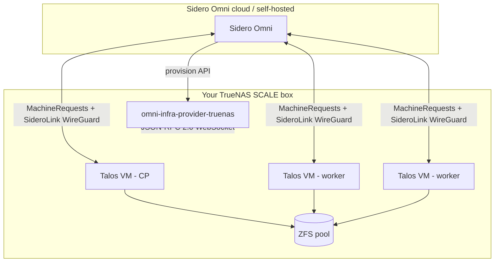

**TL;DR — This is the complete guide for running Kubernetes on a TrueNAS SCALE 25.04+ box using Talos Linux VMs managed by Sidero Omni. It interlinks every post in the series — install, sizing, storage, networking, upgrades, comparisons, the failure modes — so you can navigate to whatever you need without re-reading the whole thing. Bookmark this page.**

I'm Zac Clifton. I maintain [`omni-infra-provider-truenas`](https://github.com/bearbinary/omni-infra-provider-truenas) and daily-drive this exact stack at home. This page is the canonical entry point for everything I've written about it.

For first principles — *why* this path exists at all — start with the [origin story](https://dev.to/cliftonz/truenas-killed-kubernetes-so-i-brought-it-back-4n7h).

---

## Pick your starting point

| If you... | Start here |
|---|---|
| Have never run Kubernetes on TrueNAS and want a working cluster | → [Install Guide](#install) |
| Are evaluating Kubernetes paths and trying to decide between options | → [Comparisons](#comparisons) |
| Have a cluster running and want to make it production-ready | → [Day-2 Operations](#day-2-operations) |
| Are debugging a specific problem | → [Failure Modes](#failure-modes) |
| Want to understand the project deeply (Go internals, design choices) | → [Build-in-public series](#build-in-public) |

---

## The stack at a glance

Three components:

- **[TrueNAS SCALE 25.04+](https://www.truenas.com/truenas-scale/)** — hosts the VMs, provides ZFS storage
- **[Sidero Omni](https://omni.siderolabs.com/)** — manages the Kubernetes cluster (free tier covers homelab use)
- **[Talos Linux](https://www.talos.dev/)** — the immutable OS each VM boots into

Plus the glue I maintain: [`omni-infra-provider-truenas`](https://github.com/bearbinary/omni-infra-provider-truenas), MIT licensed, listed on the TrueNAS apps community catalog.

---

## 1. Install

The canonical install guide. Cold NAS to running cluster in about an evening:

→ **[Kubernetes on TrueNAS SCALE: the Talos + Omni Path (2026 Guide)](https://dev.to/cliftonz/<hero-post-slug>)** — the hero post. Read this first if you've never run the stack.

Companion video (full screencast walkthrough, my actual rack):

→ **[Self-hosted Kubernetes on a TrueNAS box, start to finish](#)** — V2 YouTube (~15 minutes)

Origin context (why this path even exists):

→ **[TrueNAS killed Kubernetes — so I brought it back](https://dev.to/cliftonz/truenas-killed-kubernetes-so-i-brought-it-back-4n7h)** — build-in-public origin story

---

## 2. Comparisons — picking your path

If you're not sure whether this is the right approach, read the honest comparisons:

→ **[Talos + Omni on TrueNAS vs k3s in a TrueNAS VM](https://dev.to/cliftonz/<talos-vs-k3s-slug>)** — the two real Kubernetes paths on TrueNAS in 2026, named honestly. ([Video version](#))

→ **[Running Kubernetes on TrueNAS vs Proxmox](https://dev.to/cliftonz/<truenas-vs-proxmox-slug>)** — when each architecture wins, 8 tradeoff axes. ([Video version](#))

**One-line summary**: most homelab users on TrueNAS should pick Talos + Omni via this provider. If you need GPU passthrough or live migration, go Proxmox. If you only need single-node Docker, use the built-in TrueNAS apps.

---

## 3. Day-2 operations — making it production-ready

Install is the easy part. Living with a cluster is where the real engineering happens.

### Sizing

→ **[Sizing Talos control planes on TrueNAS](https://dev.to/cliftonz/<sizing-post-slug>)** — when 2 GB stops being enough. Four observable triggers, sizing table by cluster scale, how to resize safely.

The TL;DR: a 2 vCPU / 2 GB control plane is fine for raw clusters. The moment you install Crossplane, Argo CD with many ApplicationSets, or Prometheus Operator at full scrape, bump to 4 vCPU / 4 GB. Apiserver swaps under load otherwise.

### Storage

→ **[Storage for homelab Kubernetes: Longhorn vs democratic-csi vs NFS](#)** — V5 YouTube, what I run for which workload.

The TL;DR: Longhorn for the default StorageClass (you'll need the `storage_disk_size` knob on workers). democratic-csi if you want every PVC backed by a ZFS dataset. NFS only for read-mostly workloads.

### Networking

→ **[Networking for TrueNAS-hosted Kubernetes — bridges, MetalLB, DHCP, the lot](#)** — V7 YouTube, full networking setup.

The TL;DR: one bridge, three IP ranges (DHCP pool / MetalLB / VIP) inside one /24, no overlap. Set your router's DHCP range to end at .200. Use Talos VIP for the cheapest possible HA.

### Upgrades

→ **[Upgrading a Talos cluster on TrueNAS via Omni — without breaking ZFS](https://dev.to/cliftonz/<upgrade-post-slug>)** — the playbook. Pre-flight ritual, etcd + ZFS snapshots, the rolling upgrade, what to do when Omni stalls. ([Video version](#))

The TL;DR: etcd snapshot via Omni, recursive ZFS snapshot, then Talos upgrade, then Kubernetes upgrade, then wait 24 hours before deleting snapshots. Don't bundle the provider upgrade in the same window.

---

## 4. Failure modes — the gotchas

The bugs that bite real users, named clearly:

| Symptom | Root cause | Fix |
|---|---|---|
| Cluster looks intermittently broken, no obvious cause | HDD pool, no SLOG, etcd fsync at 50–200 ms | Add NVMe SLOG **or** apply the HDD timeout patch from the [sizing post](https://dev.to/cliftonz/<sizing-post-slug>) |
| `pool not found` error in provider logs | MachineClass `pool` set to a nested path (e.g., `tank/k8s`) | `pool` is top-level only. Use `dataset_prefix: k8s` for nesting |
| VM fails to start with ENOMEM | `memory` reservation exceeded host RAM available | v0.16.1+ fails this loud at schema time. Pre-v0.16.1: set `min_memory` to a reasonable floor |
| MetalLB IPs conflict with DHCP-assigned addresses | Router DHCP range overlaps MetalLB pool | Shrink router DHCP range to `.50–.200`. Reserve `.201–.250` for MetalLB |
| `kubectl top` not working | metrics-server can't scrape Talos kubelet (self-signed cert) | Bootstrap kubelet-serving-cert-approver at cluster creation (see [hero post](https://dev.to/cliftonz/<hero-post-slug>) Step 7) |
| Mysterious dropped packets on additional NICs | MTU mismatch between bridge, switch port, and VM NIC | All three must match. `mtu: 9000` in `additional_nics` requires bridge + switch at 9000 too |
| Provider won't adopt VMs after a version upgrade | v0.15+ namespaced VM names; old VMs use legacy shape | Drain MachineSets before upgrading; let v0.14 VMs deprovision normally |
| Talos node won't come back after upgrade | etcd is taking forever (slow ZFS) or hit a Talos-version-specific bug | Check etcd logs via talosctl. Wait 5 more minutes. If still stuck, reset the node and reprovision against previous version |

---

## 5. Build-in-public — the internals

The "how this got built and why it's shaped the way it is" series. Skip if you just want to use the project; read if you want to understand it.

→ **[A SAST sweep on a 5kLOC Go infra provider: 6 findings, 6 lessons](https://dev.to/cliftonz/<sast-retro-slug>)** — what the security sweep caught, what it missed, what I'd do differently next time.

→ **[The singleton-lease pattern: leader election when your SDK doesn't have one](https://dev.to/cliftonz/<singleton-lease-slug>)** — ~200 lines of Go, optimistic concurrency, fencing tokens, the upstream bug I had to route around.

→ **[6 months shipping a niche infra tool: numbers, lessons, what I'd do differently](https://dev.to/cliftonz/<retro-slug>)** — the honest retro on marketing a solo-maintained OSS project.

→ **[How [User] runs Kubernetes on a single TrueNAS box](https://dev.to/cliftonz/<case-study-slug>)** — a real user's setup, opinions, pain points, and advice.

---

## 6. Reference materials (on the repo)

For the parts that are too long-tail or too quickly-changing for a blog post:

- **[Hero install guide](https://github.com/bearbinary/omni-infra-provider-truenas/blob/main/docs/getting-started.md)** — the in-repo version of the install walkthrough, kept in sync with each release
- **[TrueNAS setup](https://github.com/bearbinary/omni-infra-provider-truenas/blob/main/docs/truenas-setup.md)** — bridge setup, NFS shares, iSCSI, API keys
- **[Storage guide](https://github.com/bearbinary/omni-infra-provider-truenas/blob/main/docs/storage.md)** — Longhorn install, democratic-csi setup, NFS PVs
- **[Sizing guide](https://github.com/bearbinary/omni-infra-provider-truenas/blob/main/docs/sizing.md)** — the canonical sizing reference (the blog post's source)
- **[Networking guide](https://github.com/bearbinary/omni-infra-provider-truenas/blob/main/docs/networking.md)** — bridges, DHCP, MetalLB, VIP, router-specific notes
- **[Multi-homing](https://github.com/bearbinary/omni-infra-provider-truenas/blob/main/docs/multihoming.md)** — additional NICs for storage / segmentation
- **[CNI guide](https://github.com/bearbinary/omni-infra-provider-truenas/blob/main/docs/cni.md)** — Flannel, Cilium, Calico on Talos
- **[Backups](https://github.com/bearbinary/omni-infra-provider-truenas/blob/main/docs/backup.md)** — Velero + Restic configs
- **[Hardening](https://github.com/bearbinary/omni-infra-provider-truenas/blob/main/docs/hardening.md)** — key rotation, network isolation, ZFS encryption
- **[Troubleshooting](https://github.com/bearbinary/omni-infra-provider-truenas/blob/main/docs/troubleshooting.md)** — common issues with diagnostics + fixes
- **[Upgrading](https://github.com/bearbinary/omni-infra-provider-truenas/blob/main/docs/upgrading.md)** — version-by-version notes, breaking changes
- **[Architecture deep-dive](https://github.com/bearbinary/omni-infra-provider-truenas/blob/main/docs/architecture.md)** — the diagrams and component model

---

## 7. YouTube channel — the video companion

Every post in this guide has a video version. Subscribe for monthly drops:

→ **[Channel link]** — Zac Clifton on YouTube.

Video order, if you're starting from scratch:

1. **V1** — channel intro: who I am, what I'm building, why TrueNAS
2. **V2** — install walkthrough (companion to this hero post)
3. **V3** — Talos + Omni vs k3s on TrueNAS comparison
4. **V4** — TrueNAS vs Proxmox decision matrix
5. **V5** — storage deep-dive (Longhorn vs democratic-csi vs NFS)
6. **V6** — upgrading Talos live, real cluster
7. **V7** — networking deep-dive (bridges, MetalLB, DHCP, VIP)
8. **V8** — 6-month retrospective on building this in public

---

## 8. Getting help

The contribution model is **issues-only** — no PRs accepted on the main repo (long story, [reasoning in CONTRIBUTING.md](https://github.com/bearbinary/omni-infra-provider-truenas/blob/main/CONTRIBUTING.md)). But issues are very much welcome.

**File an issue if**:

- You hit a bug
- You hit a documentation gap
- You have a feature request
- You're running it and have a setup story worth telling (next case study?)
- You're confused about whether your hardware will work

**Find me elsewhere**:

- LinkedIn: [link]
- dev.to: [dev.to/cliftonz](https://dev.to/cliftonz)
- TrueNAS Community Forum: as `cliftonz` (or similar — check sidebar)

---

## 9. About the project

`omni-infra-provider-truenas` is an open-source Omni infrastructure provider for TrueNAS SCALE. It's MIT licensed, maintained by [Bear Binary](#) (which is me), and shipped under an issues-only contribution model. Current version: [v0.X.Y]. Available on:

- The TrueNAS apps community catalog (one-click install)
- GHCR: `ghcr.io/bearbinary/omni-infra-provider-truenas`
- GitHub: source + issues

This guide is the canonical entry point. It gets updated when the project does. If you find a broken link, an outdated screenshot, or a section that's just plain wrong — file an issue. That's how this page stays good.

---

**About the author**: Zac Clifton is an infrastructure engineer building tools for self-hosters and small teams. He maintains `omni-infra-provider-truenas` and writes about pragmatic homelab Kubernetes. Subscribe on [YouTube](#) for monthly deep-dives on Talos, Omni, TrueNAS, and the parts of self-hosted infra nobody else is writing about.

---

## Editor notes (delete before publish)

- This hub page is the M6 anchor. Its job is to rank for `self-hosted kubernetes truenas`, `kubernetes truenas scale guide`, and similar long-tail multi-word queries.
- **Before publishing**: fill in every `<slug>` placeholder with the live dev.to URL. Same for `[Channel link]`, `[LinkedIn]`, `[v0.X.Y]`.
- Update the "Failure modes" table every time you ship a new release. This is the highest-utility section for returning visitors and the one that earns the bookmark.
- Optional: render the Mermaid diagram to PNG and host it on GitHub raw, then embed the image as a fallback for platforms that don't render Mermaid (LinkedIn previews especially).
- Set the dev.to `canonical_url` to point at *this* page's eventual URL — this is the canonical of the canonicals.
