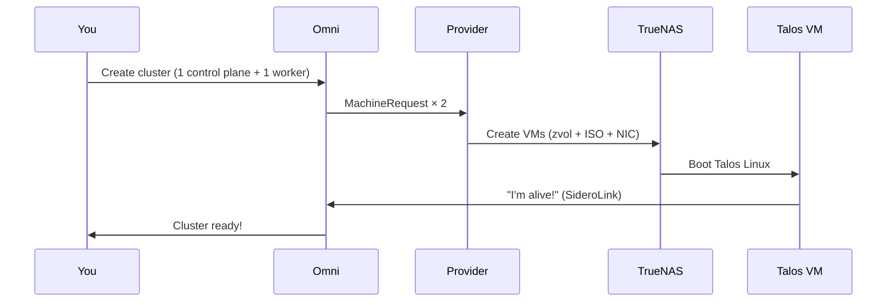

# Getting Started: From NAS to Kubernetes Cluster

A complete walkthrough for setting up Kubernetes on your TrueNAS SCALE server using this provider. No prior Kubernetes experience required.

## What You're Building

By the end of this guide, you'll have:

- A **Kubernetes cluster** running on your TrueNAS NAS as virtual machines
- A **web dashboard** (Omni) to manage your cluster
- The ability to **deploy apps** to your cluster with `kubectl`


## The Three Pieces (and Why You Need Them)

This project uses three tools together. Here's what each one does:

| Tool | What It Is | Why You Need It |
|---|---|---|
| **[TrueNAS SCALE](https://www.truenas.com/truenas-scale/)** | Your NAS operating system | Runs the VMs that become your Kubernetes nodes |
| **[Sidero Omni](https://omni.siderolabs.com/)** | Kubernetes management platform | Creates and manages your cluster — the "brain" |
| **[Talos Linux](https://www.talos.dev/)** | A minimal OS built only for Kubernetes | Runs inside each VM — boots, joins the cluster, nothing else |

**This provider** is the glue. It listens to Omni and automatically creates/destroys Talos Linux VMs on your TrueNAS server.

> **Why Talos instead of Ubuntu?** Talos is purpose-built for Kubernetes — it has no SSH, no shell, no package manager, and no way to drift from its config. It's immutable and secure by default. You manage it entirely through Kubernetes APIs and Omni. This sounds restrictive but it means your cluster nodes are identical, reproducible, and nearly impossible to misconfigure.

## What You'll Need

### Hardware Requirements

Your TrueNAS server needs enough resources to run both NAS duties and Kubernetes VMs:

| Resource | Minimum (1-node cluster) | Recommended (3-node cluster) | Comfortable (5+ nodes) |
|---|---|---|---|
| **CPU** | 4 cores | 8 cores | 16+ cores |
| **RAM** | 16 GB total | 32 GB total | 64+ GB total |
| **Disk** | 50 GB free on ZFS pool | 100 GB free | 500+ GB free |

**How to think about it:**
- TrueNAS itself needs ~8 GB RAM
- Each Kubernetes control plane node: 2 vCPUs + 2 GB RAM + 10 GB disk
- Each worker node: 4 vCPUs + 8 GB RAM + 100 GB disk
- So a 3-node cluster (1 control plane + 2 workers) needs: ~10 vCPUs, ~18 GB RAM, ~210 GB disk — plus what TrueNAS uses

> **Will this affect my NAS?** The VMs share your NAS hardware. If you provision too many VMs, your file sharing and other NAS tasks will slow down. Start small (1-2 nodes) and scale up as you learn what your hardware can handle.

### Software Requirements

- **TrueNAS SCALE 25.04+** (Fangtooth) — check your version in the TrueNAS dashboard
- **A web browser** — for both TrueNAS and Omni UIs
- **A terminal** — for `omnictl` and `kubectl` commands

### Network Requirements

- Your NAS must have **internet access** (VMs need to reach Omni's servers)
- **DHCP** must be available on your network (VMs get their IP automatically)
- A **bridge interface** on TrueNAS (we'll create this in Step 2)

---

## Step 1: Sign Up for Omni

Omni is the management platform that orchestrates your Kubernetes cluster.

> **Is it free?** Omni offers a free tier for personal/homelab use. Check [omni.siderolabs.com](https://omni.siderolabs.com/) for current pricing. You can also self-host Omni if you prefer.

1. Go to [omni.siderolabs.com](https://omni.siderolabs.com/) and create an account
2. Once logged in, you'll see the Omni dashboard — this is where you'll manage your cluster later

### Install omnictl

`omnictl` is the command-line tool for managing Omni. You'll use it to create the service account the provider needs.

**macOS:**
```bash
brew install siderolabs/tap/omnictl
```

**Linux:**
```bash
curl -sL https://omni.siderolabs.com/omnictl/latest/omnictl-linux-amd64 -o /usr/local/bin/omnictl
chmod +x /usr/local/bin/omnictl
```

**Authenticate omnictl with your Omni instance:**
```bash
omnictl config url https://your-omni-instance.omni.siderolabs.com
# Follow the browser-based login prompt
```

### Create the Service Account

The provider needs a service account key to talk to Omni:

```bash
omnictl serviceaccount create --role=InfraProvider infra-provider:truenas
```

**This outputs a long key. Copy and save it now — it is only shown once.** If you lose it, you'll need to delete and recreate the service account.

The key will look something like:
```
base64-encoded-key-that-is-very-long...
```

---

## Step 2: Prepare Your TrueNAS Server

### Check Your TrueNAS Version

Log into your TrueNAS web UI. The dashboard shows the version. You need **25.04 or newer** (codename "Fangtooth").

If you're on an older version, update first: **System > Update**.

### Identify Your ZFS Pool

Go to **Storage** in TrueNAS. Note the name of your pool — common names are `tank`, `data`, or `default`. This is where VM disks will be stored.

> **How much space will this use?** Each VM's disk is a ZFS zvol. A control plane node uses ~10 GB, a worker ~100 GB. The Talos ISO (~100 MB) is cached once and shared. ZFS compression helps — actual usage is often less than the allocated size.

### Create a Network Bridge

VMs need a network interface. The easiest option is a **bridge** — it lets VMs share your NAS's physical network.

1. Go to **Network > Interfaces**
2. Click **Add**
3. Select **Type: Bridge**
4. **Bridge Members**: select your primary network interface (e.g., `enp5s0`, `eno1` — the one your NAS uses for its IP)
5. **Name**: leave the default (usually `br0`) or name it something like `br0`
6. **DHCP**: Enable (so VMs get IPs from your router)
7. Click **Save**

> **Warning:** Creating a bridge on your primary interface will briefly interrupt your NAS's network connection. This is normal — it's moving the NAS's IP to the bridge. The NAS and all VMs will then share this bridge.

8. **Apply the network changes** when prompted. Your NAS may briefly disconnect.
9. After reconnecting, verify the bridge appears under **Network > Interfaces** and has an IP address.

**Note the bridge name** (e.g., `br0`) — you'll need it in Step 3.

---

## Step 3: Install the Provider

The provider runs as an app on your TrueNAS server. It watches Omni for requests and creates VMs automatically.

1. Go to **Apps** in TrueNAS
2. Click **Discover Apps** > **Custom App** (or **Install via Docker Compose**)
3. Paste this configuration:

```yaml
services:
  omni-infra-provider-truenas:
    image: ghcr.io/bearbinary/omni-infra-provider-truenas:latest
    restart: unless-stopped
    volumes:
      - /var/run/middleware:/var/run/middleware:ro
    network_mode: host
    environment:
      OMNI_ENDPOINT: "https://your-omni-instance.omni.siderolabs.com"
      OMNI_SERVICE_ACCOUNT_KEY: "paste-your-key-from-step-1-here"
      DEFAULT_POOL: "tank"
      DEFAULT_NIC_ATTACH: "br0"
```

4. **Replace the four values:**
   - `OMNI_ENDPOINT` — your Omni URL (from Step 1)
   - `OMNI_SERVICE_ACCOUNT_KEY` — the key you saved in Step 1
   - `DEFAULT_POOL` — your ZFS pool name (from Step 2)
   - `DEFAULT_NIC_ATTACH` — your bridge name (from Step 2)

5. Click **Deploy** / **Install**

### Verify It's Running

Check the app logs in TrueNAS. You should see:

```
"startup checks passed" transport=socket pool=tank nic_attach=br0
"starting TrueNAS infra provider" provider_id=truenas omni_endpoint=https://...
```

If you see both lines, the provider is connected and ready.

**If you see errors**, check [docs/troubleshooting.md](troubleshooting.md).

---

## Step 4: Create Your First Kubernetes Cluster

Now the fun part. Go to the **Omni web UI** in your browser.

### Create a MachineClass

A MachineClass defines what a VM looks like (how many CPUs, how much RAM, etc.). Run this in your terminal:

```bash
cat <<'EOF' | omnictl apply -f -
metadata:
  namespace: default
  type: MachineClasses.omni.sidero.dev
  id: truenas-small
spec:
  autoprovision:
    providerid: truenas
    grpcendpoint: ""
    icon: ""
    configpatch: |
      cpus: 2
      memory: 2048
      disk_size: 10
EOF
```

This creates a "small" machine template: 2 CPUs, 2 GB RAM, 10 GB disk — suitable for a control plane node.

### Create a Worker MachineClass

```bash
cat <<'EOF' | omnictl apply -f -
metadata:
  namespace: default
  type: MachineClasses.omni.sidero.dev
  id: truenas-worker
spec:
  autoprovision:
    providerid: truenas
    grpcendpoint: ""
    icon: ""
    configpatch: |
      cpus: 2
      memory: 4096
      disk_size: 40
EOF
```

### Create the Cluster in Omni

1. In the Omni web UI, go to **Clusters > Create Cluster**
2. Give your cluster a name (e.g., `homelab`)
3. For the **control plane**: choose **Auto Provision**, select the `truenas` provider, pick the `truenas-small` MachineClass, set replicas to **1**
4. For **workers**: choose **Auto Provision**, select the `truenas` provider, pick the `truenas-worker` MachineClass, set replicas to **1**
5. Click **Create**

### Watch It Happen

This is the best part. Watch both TrueNAS and Omni:

- **TrueNAS UI > Virtualization**: You'll see VMs appearing (named like `omni-<random>`)
- **Omni UI > Machines**: You'll see machines registering as they boot
- **Omni UI > Clusters**: Your cluster will show progress as nodes join

The whole process takes **2-5 minutes** per node. Here's what's happening behind the scenes:



---

## Step 5: Access Your Cluster

Once Omni shows your cluster as **Running**, you can get the kubeconfig and start using it.

### Install kubectl

If you don't have `kubectl` yet:

**macOS:**
```bash
brew install kubectl
```

**Linux:**
```bash
curl -LO "https://dl.k8s.io/release/$(curl -L -s https://dl.k8s.io/release/stable.txt)/bin/linux/amd64/kubectl"
chmod +x kubectl && sudo mv kubectl /usr/local/bin/
```

### Download Your Kubeconfig

```bash
# Download the kubeconfig from Omni
omnictl kubeconfig -c homelab > ~/.kube/config
```

Replace `homelab` with whatever you named your cluster.

### Verify the Connection

```bash
kubectl get nodes
```

You should see your nodes:
```
NAME           STATUS   ROLES           AGE   VERSION
omni-abc123    Ready    control-plane   5m    v1.32.x
omni-def456    Ready    <none>          4m    v1.32.x
```

You now have a working Kubernetes cluster running on your NAS.

---

## Step 6: Deploy Your First App

Let's deploy something to prove it works. We'll run nginx — a simple web server.

```bash
# Create a deployment
kubectl create deployment hello --image=nginx

# Expose it as a service
kubectl expose deployment hello --port=80 --type=NodePort

# Check it's running
kubectl get pods
```

Wait until the pod shows `Running`:
```
NAME                    READY   STATUS    RESTARTS   AGE
hello-abc123-xyz        1/1     Running   0          30s
```

Find the NodePort to access it:
```bash
kubectl get service hello
```

Look for the port mapping (e.g., `80:31234/TCP`). Open `http://<any-vm-ip>:31234` in your browser. You should see the nginx welcome page.

Congratulations — you just deployed an app on Kubernetes running on your NAS.

---

## What's Next?

Now that you have a working cluster, here are some things to explore:

### Learn Kubernetes Basics
- [Kubernetes Official Tutorial](https://kubernetes.io/docs/tutorials/kubernetes-basics/) — interactive, beginner-friendly
- [Talos Linux Docs](https://www.talos.dev/latest/) — learn about the OS your nodes run
- [Omni Docs](https://omni.siderolabs.com/docs/) — cluster management, scaling, upgrades

### Scale Your Cluster
Add more nodes by updating the worker replica count in Omni. The provider will automatically create new VMs.

### Install a Package Manager
[Helm](https://helm.sh/) makes it easy to install pre-packaged apps:
```bash
brew install helm  # or your OS equivalent
```

### Popular Homelab Apps for Kubernetes
| App | What It Does | Install |
|---|---|---|
| [Portainer](https://www.portainer.io/) | Web UI for managing containers | `helm install portainer portainer/portainer` |
| [Pi-hole](https://pi-hole.net/) | Network-wide ad blocker | Helm chart available |
| [Home Assistant](https://www.home-assistant.io/) | Home automation | Helm chart available |
| [Grafana + Prometheus](https://grafana.com/) | Monitoring and dashboards | `helm install kube-prometheus-stack` |
| [Nextcloud](https://nextcloud.com/) | Self-hosted cloud storage | Helm chart available |
| [Jellyfin](https://jellyfin.org/) | Media server | Helm chart available |

### Set Up Persistent Storage
Your apps might need persistent storage (databases, file storage). Look into:
- [democratic-csi](https://github.com/democratic-csi/democratic-csi) — uses your TrueNAS NFS/iSCSI shares as Kubernetes storage
- [Longhorn](https://longhorn.io/) — distributed storage that runs inside Kubernetes

### Clean Up
To delete the test deployment:
```bash
kubectl delete deployment hello
kubectl delete service hello
```

To remove the entire cluster, delete it in the Omni UI. The provider will automatically stop and delete all VMs and clean up storage.

---

## FAQ

### Does Omni cost money?
Omni has a free tier for personal and homelab use. Check [omni.siderolabs.com](https://omni.siderolabs.com/) for current pricing. You can also self-host Omni for free.

### Will this affect my NAS performance?
Yes — VMs share your NAS hardware. Each VM uses CPU, RAM, and disk. Start with a small cluster and monitor your NAS performance. You can always remove VMs if things slow down.

### How much disk space will this use?
- Talos ISO: ~100 MB (cached once, shared by all VMs)
- Control plane VM: ~10 GB each
- Worker VM: ~40-100 GB each (depends on your MachineClass config)
- All storage is ZFS-compressed, so actual usage is often less

### Can I use this without internet?
No. VMs need outbound internet to:
- Download the Talos ISO from Image Factory (first time only, then cached)
- Connect to Omni via SideroLink (WireGuard tunnel on port 443)

Your NAS and VMs need outbound HTTPS. No inbound ports need to be opened.

### Can I SSH into the Kubernetes nodes?
No. Talos Linux has no SSH, no shell, and no package manager by design. You manage nodes through `kubectl`, `talosctl`, and the Omni UI. This is a security feature — there's nothing to hack.

### What if my NAS reboots?
The VMs will stop when TrueNAS shuts down and restart when it comes back. The provider auto-recovers and reconnects to Omni. Your Kubernetes workloads will restart automatically (Kubernetes handles this).

### Can I run this on TrueNAS CORE (FreeBSD)?
No. This requires TrueNAS **SCALE** (Linux-based) version 25.04 or newer. TrueNAS CORE is not supported.

### What's the difference between control plane and worker nodes?
- **Control plane**: Runs the Kubernetes "brain" — the API server, scheduler, and etcd database. Needs minimal resources (2 CPU, 2 GB RAM, 10 GB disk). You need at least 1, ideally 3 for high availability.
- **Workers**: Run your actual applications (containers). Need more resources depending on your workloads. Start with 1-2 and add more as needed.

### Can I mix this with physical machines?
Yes. Omni can manage both VM-based nodes (from this provider) and physical bare-metal nodes simultaneously in the same cluster.

### How do I update Kubernetes?
Omni handles Kubernetes and Talos upgrades through its UI. You don't need to SSH into anything — just click "Upgrade" in the Omni dashboard.
