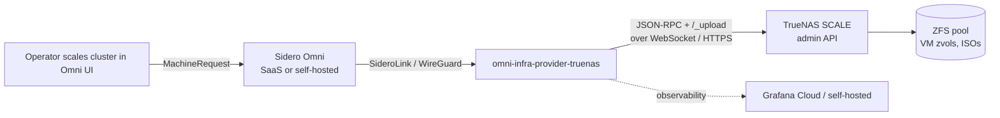

# Security Hardening

This document is the opinionated guide to deploying `omni-infra-provider-truenas` with the smallest reasonable blast radius. Every recommendation here has a specific threat it addresses and, where relevant, an empirical verification against TrueNAS SCALE 25.10.1.

Use it as a checklist: the high-impact items are at the top, aspirational / code-change items at the bottom.

## Threat model

The provider sits between two sensitive systems:



The provider holds two high-value credentials:

- **`OMNI_SERVICE_ACCOUNT_KEY`** — authenticates to Omni with permission to read/write MachineRequests for one provider ID.
- **`TRUENAS_API_KEY`** — authenticates to TrueNAS with permission to create/delete VMs, zvols, upload ISOs, etc. Effectively root-equivalent in the common configuration (see [API Key Hardening](#api-key-hardening) below).

Primary threats we mitigate:

| Threat | Mitigated by |
|---|---|
| Provider service account leaks and an attacker controls VMs on the NAS | Dedicated non-root TrueNAS user, independently revocable. Network isolation. Key rotation. |
| `.env` file committed to git / left world-readable | Gitignore, `chmod 0400`, Kubernetes Secret, prefer TrueNAS app's built-in secret storage. |
| MITM on TrueNAS WebSocket steals the API key | Proper TLS cert (not self-signed in production). `TRUENAS_INSECURE_SKIP_VERIFY=false`. Management VLAN. |
| VM zvols compromised at rest (stolen disk, pool export) | Per-zvol ZFS encryption via `encrypted: true` in MachineClass. |
| Container escape or compromised image runs with excess host privileges | Distroless base, non-root uid 65534, read-only root, image signing + SBOM, pinned image tag. |
| Compromised provider binary silently publishes broken images | Cosign keyless signing, SBOM attestation, pipeline smoke test (see [release workflow](https://github.com/bearbinary/omni-infra-provider-truenas/blob/main/.github/workflows/release.yaml)). |

Out of scope:

- Attacker with physical access to the TrueNAS host. (Use TrueNAS's own full-disk-encryption / boot-env story.)
- Compromised Omni SaaS / self-hosted instance. Separate trust boundary.
- Supply-chain compromise of the Talos Linux image. Bound by the Talos Image Factory's signing story.

## API key hardening

The `TRUENAS_API_KEY` is the highest-value credential in the deployment. Eight practical layers, ordered by today's feasibility:

### 1. Dedicated non-root user in `builtin_administrators` (baseline)

What the project's `docs/truenas-setup.md#5-api-key` recommends. Benefits over the `root` user's key:

- **Separate audit trail.** TrueNAS logs the dedicated user (e.g. `omni-provider`) on every API call. In the audit UI you can filter by user and see exactly which calls came from the provider.
- **Independent revocation.** Disabling the user stops the provider immediately without touching root login or other admin activity.
- **No password attack surface.** The service user has password disabled (API-only) → no console / SSH / SMB password-guessing vector. `root` typically has a password for console access.
- **Blast radius is the same as root** (the user is in `builtin_administrators`, which grants `FULL_ADMIN`), but discovery and containment are much better.

**Do not** use the literal `root` user's API key. No benefit, worse audit, worse containment.

### 2. Rotate the key regularly

TrueNAS supports multiple active keys per user, so rotation can be zero-downtime:

1. **Credentials → API Keys → Add** a second key for the service user. Name it with a date suffix (e.g. `omni-infra-provider-2026-04`).
2. Update the deployment's `TRUENAS_API_KEY` env var.
3. Restart / rollout the provider pod or container.
4. Verify provider logs show `TrueNAS client connected`.
5. **Credentials → API Keys →** delete the old key.

Quarterly rotation is a reasonable default for homelab / small prod. Automated rotation via TrueNAS middleware API is possible but adds complexity; most deployments don't need it.

### 3. Scope privileges via a custom Privilege (partial — see caveats)

The provider calls ~22 JSON-RPC methods + one HTTP endpoint (`/_upload`). A custom Privilege with these 13 roles authorizes every JSON-RPC call:

```
READONLY_ADMIN
VM_READ, VM_WRITE, VM_DEVICE_READ, VM_DEVICE_WRITE
DATASET_READ, DATASET_WRITE, DATASET_DELETE
POOL_READ, DISK_READ, NETWORK_INTERFACE_READ
FILESYSTEM_ATTRS_READ, FILESYSTEM_DATA_WRITE
```

**But** the `/_upload` HTTP endpoint (Talos ISO upload) requires the `SYS_ADMIN` account attribute, which is **only** granted by `builtin_administrators` membership. No combination of scoped roles substitutes for it.

This was verified empirically on TrueNAS SCALE 25.10.1 and filed upstream — see [`docs/upstream-bugs/truenas-upload-role-gap.md`](upstream-bugs/truenas-upload-role-gap.md). Until upstream fixes it, a scoped-roles-only setup breaks ISO upload.

**Three ways to actually use scoped roles today**:

| Approach | How | Trade-off |
|---|---|---|
| **(a)** Run with `builtin_administrators` membership (default) | Do nothing special | Equivalent to FULL_ADMIN |
| **(b)** Use scoped roles + pre-populate ISOs manually | Admin SSH's to TrueNAS and copies `<sha>.iso` into `/mnt/<pool>/talos-iso/` once per Talos version | Manual step per version; breaks "fully automated" story |
| **(c)** Use scoped roles + provider code change to skip `/_upload` | Future work — see [Rung 8](#8-provider-code-change-skip-_upload-entirely) | Would need to download ISO from Image Factory on each provision instead |

### 4. Network-level controls

Role hardening means nothing if the API surface is reachable from untrusted networks. Concrete steps:

- **Management VLAN.** Put TrueNAS's admin interface (HTTPS, WebSocket) on a dedicated management VLAN — *not* the workload network. Allow ingress from the provider's network only.
- **Firewall allow-list.** Restrict `:443` on TrueNAS to the provider's source IP range:

   ```bash
   # On a Linux firewall / pfSense / Mikrotik / etc, example iptables:
   iptables -A INPUT -p tcp --dport 443 -s <provider-cidr> -j ACCEPT
   iptables -A INPUT -p tcp --dport 443 -j DROP
   ```

- **Never expose the TrueNAS API to the internet.** If you need remote admin, VPN in first (WireGuard, Tailscale, etc.) to the management VLAN.
- **If the provider runs on the TrueNAS host itself** (Docker Compose on TrueNAS via Apps → Discover → Install via YAML), set `TRUENAS_HOST=localhost`. The API traffic never leaves the host's loopback.

### 5. Secret storage

The API key is only as safe as its resting place.

**Kubernetes (Helm or raw manifests):**
- Use a `Secret` (not ConfigMap):
   ```yaml
   apiVersion: v1
   kind: Secret
   metadata: {name: omni-infra-provider-truenas-secrets}
   type: Opaque
   stringData:
     truenas-api-key: "1-AbCd..."
     omni-service-account-key: "..."
   ```
- Mount as environment variables via `envFrom.secretRef`, not inline values.
- GitOps-friendly alternatives: sealed-secrets (bitnami), external-secrets-operator + Vault/AWS/GCP, SOPS-encrypted YAML.

**Docker Compose on TrueNAS:**
- The compose YAML is stored in TrueNAS's app database, readable by any TrueNAS admin. That's the same blast radius as root anyway, so acceptable here — but means any TrueNAS admin can read the Omni service account key.

**Standalone Docker / systemd:**
- Use an `.env` file with `chmod 0400` owned by the container's runtime uid (65534 for this provider as of v0.14.5).
- Never check `.env` into git. The repo's `.gitignore` has `.env` excluded; only `.env.example` (with placeholder values) is tracked.
- Consider `docker secret` or `systemd` `LoadCredential=` for longer-running bare-metal deployments.

### 6. TLS hygiene

- **Production**: use a CA-signed certificate on TrueNAS (Let's Encrypt via HTTP-01 on your management VLAN, internal ACME, or a commercial CA). Set `TRUENAS_INSECURE_SKIP_VERIFY=false`.
- **Homelab**: if running a self-signed cert, either:
   - Put TrueNAS on a management VLAN and set `INSECURE_SKIP_VERIFY=true` (accepts that anyone on the VLAN could MITM, but the VLAN is trusted), OR
   - Install TrueNAS's self-signed CA into the provider container's trust store (adds complexity; rarely worth it over a real cert).
- **`TRUENAS_HOST=localhost`**: `INSECURE_SKIP_VERIFY=true` is fine — MITM requires local loopback access, which means the host is already compromised.

### 7. Log collection for detection

Hardening without monitoring is incomplete. You want to know *when* something unexpected happens.

- **TrueNAS audit log** (`System Settings → Audit`). Filter by the service user to spot out-of-hours activity, unexpected method calls, or failed auth attempts.
- **Provider OTEL logs + traces.** Ship to Grafana Cloud / self-hosted per `docs/architecture.md`. Watch for:
   - `startup checks passed` not appearing at expected intervals (provider is down)
   - Repeated `failed to connect to TrueNAS` (key rotated / user disabled / API down)
   - Unusual `provision.createVM` frequency (possible abuse)
   - `singleton lease` errors (two providers racing — see [troubleshooting](troubleshooting.md#singleton-lease-acquire-failed-another-provider-instance-holds-the-singleton-lease))
- **Alerting.** The provider ships a Prometheus rules file as a release asset (`truenas-provider.rules.yml`). Import it alongside the Grafana dashboards for ready-made alerts.

### 8. Provider code change: skip `/_upload` entirely (aspirational)

The only reason `builtin_administrators` is required today is `/_upload`. If the provider were refactored to fetch Talos ISOs directly from the Image Factory via HTTP — bypassing the TrueNAS upload path — the scoped 13-role privilege becomes fully viable.

Sketch of the change:
- Replace the `stepUploadISO` step with a "direct-factory-URL" mode.
- Pass the Image Factory URL as a CDROM device attribute in `vm.device.create`, if bhyve / TrueNAS supports HTTP-backed CDROM (it does not natively — would need a local staging step).
- Or: have Talos itself download the ISO at boot via iPXE, skipping the CDROM entirely.

Tracked in `docs/backlog.md`. Would let security-conscious deployments opt in with e.g. `storage_mode: direct-factory-url` in MachineClass config.

Until this lands, `builtin_administrators` is the recommended configuration.

## Container / image hardening

The published Docker image applies several baseline defenses:

- **Distroless base** (`gcr.io/distroless/static-debian12:nonroot`) — no shell, no package manager, no OS vulns to patch beyond the base image's Go binary.
- **Non-root uid/gid** (`USER 65534:65534`) — `nobody`. Aligns with TrueNAS host `nobody` for bind-mount compatibility. Set explicitly in the Dockerfile; verified in CI via a Dockerfile-content grep.
- **Multi-arch signed image** — cosign keyless signing (Sigstore OIDC) on every release. SBOM attested to the image. Verify before pulling:
   ```bash
   cosign verify \
     --certificate-identity-regexp='https://github.com/bearbinary/omni-infra-provider-truenas/.*' \
     --certificate-oidc-issuer='https://token.actions.githubusercontent.com' \
     ghcr.io/bearbinary/omni-infra-provider-truenas:v0.14.6
   ```
- **CI pipeline smoke test** — release workflow runs the image before pushing multi-arch. Prevents shipping images that can't even execute (regression caught in v0.14.4; permission-denied at startup on v0.14.1–v0.14.3 from an artifact-upload bug).
- **Reproducible tag pinning** — always pin to a specific version (`v0.14.6`), never `latest` in production. Per the published [release pipeline](https://github.com/bearbinary/omni-infra-provider-truenas/blob/main/.github/workflows/release.yaml), tags are immutable.

### Kubernetes `SecurityContext` recommendations

If deploying via Helm or raw manifests, set at minimum:

```yaml
spec:
  template:
    spec:
      securityContext:
        runAsNonRoot: true
        runAsUser: 65534
        runAsGroup: 65534
        fsGroup: 65534
        seccompProfile: {type: RuntimeDefault}
      containers:
        - name: provider
          image: ghcr.io/bearbinary/omni-infra-provider-truenas:v0.14.6
          securityContext:
            allowPrivilegeEscalation: false
            readOnlyRootFilesystem: true
            capabilities: {drop: [ALL]}
```

`readOnlyRootFilesystem: true` is safe — the provider does not write to its own root filesystem.

### Docker Compose `security_opt` recommendations

```yaml
services:
  omni-infra-provider-truenas:
    image: ghcr.io/bearbinary/omni-infra-provider-truenas:v0.14.6
    read_only: true
    cap_drop: [ALL]
    security_opt:
      - no-new-privileges:true
    user: "65534:65534"
```

## ZFS encryption at rest

The provider supports per-zvol ZFS native encryption via the MachineClass config:

```yaml
configpatch:
  encrypted: true                  # root disk
  additional_disks:
    - size: 100
      encrypted: true              # data disk for Longhorn
```

Recommended for any cluster handling PII, customer data, or regulated workloads. Unlocking is tied to the pool's encryption key policy — plan for how the key is unlocked on TrueNAS reboot (passphrase, keyfile on another pool, KMIP).

Known limitations:
- Encryption key rotation is a ZFS pool operation, not per-zvol — handle at the pool layer.
- Encryption adds ~3–8% CPU overhead on zvol I/O for AES-256-GCM. Usually undetectable for VM workloads.
- Trims / zero-fill don't propagate as usefully — deleted data may persist in snapshots or in unallocated blocks until scrubbed.

## Provider version / patch hygiene

The provider follows [semantic versioning](https://semver.org/) with immutable GitHub releases. Practical hygiene:

- **Pin to a specific version** (e.g. `v0.14.6`) in production. `latest` is fine for test environments where you want to catch forward-compatibility issues early.
- **Subscribe to release notifications** on the GitHub repo. Every release has a CHANGELOG entry categorizing what changed (breaking / features / fixes / CI).
- **Upgrade fixes promptly.** Recent releases fixed silent-data-on-wrong-disk (v0.14.6), container permission denied (v0.14.4), OTLP 404s (v0.14.5), boot-order halt (v0.14.2). Running old versions accumulates known bugs.

## Omni-side hardening

The Omni service account key (`OMNI_SERVICE_ACCOUNT_KEY`) is scoped per-provider. Create it with:

```bash
omnictl serviceaccount create --role=InfraProvider infra-provider:truenas
```

The `InfraProvider` role is the minimum needed — don't use a broader role. Rotate this key alongside the TrueNAS API key on the same schedule.

TLS to Omni: `OMNI_INSECURE_SKIP_VERIFY` defaults to `false` (verified by [`TestEnvDefaults_SafetyCriticalSettings`](https://github.com/bearbinary/omni-infra-provider-truenas/blob/main/cmd/omni-infra-provider-truenas/env_defaults_test.go)). Keep it that way.

## Hardening checklist

For a new deployment, work top-down:

| Rung | Item | Status |
|---|---|---|
| 1 | Dedicated non-root TrueNAS user in `builtin_administrators` (not the `root` key) | ☐ |
| 2 | API key rotation scheduled (quarterly) | ☐ |
| 3 | Scoped privilege — if targeting pre-populated ISOs (see caveats) | ☐ optional |
| 4 | TrueNAS admin interface on a management VLAN | ☐ |
| 4 | Firewall allow-list scoping TrueNAS API to provider source IP | ☐ |
| 5 | `TRUENAS_API_KEY` stored in Kubernetes Secret / protected `.env` (not git, not ConfigMap) | ☐ |
| 5 | `OMNI_SERVICE_ACCOUNT_KEY` stored the same way | ☐ |
| 6 | CA-signed TLS cert on TrueNAS (or acknowledged self-signed trust boundary) | ☐ |
| 6 | `TRUENAS_INSECURE_SKIP_VERIFY=false` in production | ☐ |
| 6 | `OMNI_INSECURE_SKIP_VERIFY=false` in production | ☐ |
| — | Per-zvol ZFS encryption (`encrypted: true`) for sensitive clusters | ☐ |
| — | Container SecurityContext / security_opt applied | ☐ |
| — | Image pinned to specific version, cosign-verified before pull | ☐ |
| — | TrueNAS audit log ingestion + Prometheus alerts imported | ☐ |
| — | Release notifications subscribed (GitHub repo Watch → Releases only) | ☐ |

## v0.15 security model

These are the invariants the v0.15 security hardening pass established. Each one is enforced by the provider at runtime; operators should understand them before modifying state on TrueNAS by hand.

### ZFS encryption passphrase storage (known weakness)

When `encrypted: true` is set on a MachineClass, the provider generates a per-zvol passphrase via `crypto/rand` and stores it as a ZFS user property (`org.omni:passphrase`) on the same encrypted zvol. **This is a deliberate trade-off for unattended unlock**, but it materially shrinks what `encrypted: true` protects against. Operators who turn the flag on should understand exactly what they are buying.

**What ZFS user properties actually are.** They are dataset *metadata*, not encrypted data. They are readable by any caller that can:

- call `pool.dataset.query` / `zfs.dataset.user_props_query` on the dataset (any TrueNAS user with `DATASET_READ` on the path),
- run `zfs get -p` on the imported pool from a shell on the host,
- read snapshot stream metadata (`zfs send` of an encrypted dataset still emits user properties in the stream — replication targets see the passphrase),
- mount the pool on a different machine after physical media access (the keys ZFS needs to fetch the *data* are NOT needed to read user properties).

**What `encrypted: true` therefore does and does not protect against:**

| Threat | Protected? |
|---|---|
| Stolen disks, attacker has no other access | ✅ Yes — without TrueNAS host access, the user property cannot be read; the data ciphertext is useless. |
| Pool exported and re-imported on attacker hardware | ❌ No — the user property is metadata that imports with the pool. |
| Snapshot replication to an attacker-controlled target | ❌ No — `zfs send` carries the user property in the stream. |
| TrueNAS user with `pool.dataset.query` (read-only DATASET_READ) | ❌ No — one RPC reveals the passphrase. |
| TrueNAS administrator | ❌ No — superset of the previous row. |
| Lower-privileged workload sharing the same pool that can call `pool.dataset.query` | ❌ No. |

If any of the ❌ rows are in your threat model, **do not rely on `encrypted: true`** — pair it with disk-level encryption you control (e.g. SED with a KEK held off-host), or scope dataset permissions so only the provider's TrueNAS user can read user properties on the target dataset, or accept that the flag is documentation rather than defense for that workload.

**Future work (`v0.17+`).** Wrap the passphrase with a provider-held KEK supplied via env var (or a TrueNAS system keychain reference, or external KMS), so the on-disk user property becomes ciphertext the provider alone can unwrap. Tracked in `docs/backlog.md`. This is a breaking change for upgrades — existing zvols hold a plaintext property and would need a one-time rewrap.

### ISO supply chain (TOFU)

Starting in v0.15 the provider records the SHA-256 of each Talos ISO downloaded from `factory.talos.dev` as a ZFS user property (`org.omni:iso-sha256-<imageID>`) on the ISO cache dataset. On subsequent cache-miss downloads, the hash is re-derived and compared:

- **First time** — trust on first use (TOFU): record hash, continue.
- **Match** — continue.
- **Mismatch** — the recorded hash is overwritten with `POISONED-<new-hash>` and the provision fails loudly. The on-disk ISO is left in place (no `filesystem.unlink` in the client today).

The TOFU defense was strengthened in a later release with three additions:

1. **Property-read errors no longer silently degrade to "first use".** A transient `pool.dataset.query` failure used to look identical to an absent property — i.e. it became "no recorded hash, record this one as the new baseline" — which let an attacker who could induce a single failed RPC silently rotate the trusted hash. Read errors now abort the provision; the operator retries once the property RPC is healthy.
2. **Cache-hit re-verification via size + mtime.** Alongside `iso-sha256-<id>` the provider records `org.omni:iso-size-<id>` and `org.omni:iso-mtime-<id>`. On every cache hit, the file is `filesystem.stat`'d and the live values are compared against the recorded ones. A swap that doesn't preserve both metadata fields (replication-induced mtime change, in-place edit changing size, foreign workload writing to the dataset) is caught here and POISON-marked. A sophisticated attacker who can preserve both fields after a same-size byte swap still bypasses the metadata check — full re-hash on every cache hit would be stronger but TrueNAS exposes no streaming-hash RPC, and pulling the ISO bytes back to hash them locally would itself be a DoS surface.

   **Important caveat — same trust boundary.** The bytes and the user properties live behind the same TrueNAS API surface (`pool.dataset.update` accepts both). An attacker with TrueNAS write access who can rewrite the file can in the same RPC sequence rewrite `iso-sha256-<id>` + `iso-size-<id>` + `iso-mtime-<id>` to match the new bytes. From verifyCachedISO's view that is indistinguishable from a legitimate re-record. Stat-based detection is therefore meaningful against (a) actors who can write the file but not the properties — a misconfigured share, a replication target, a foreign workload — and (b) non-malicious metadata drift. It is **not** meaningful against TrueNAS admin or API-key compromise. The only true mitigation for that threat model is to store the TOFU triple in a sink the provider's API key has no write access to (Omni-side ConfigMap, sealed append-only file, external KMS reference), and that work is tracked in `docs/backlog.md`.

3. **POISON marker write retries.** On a TOFU mismatch, the marker write is retried up to three times with backoff before the provision fails. If every attempt fails, the provider logs `MANUAL CLEANUP REQUIRED` at error level AND increments the `truenas_iso_poison_marker_write_failed_total` counter so the `TrueNASISOPoisonMarkerWriteFailed` alert fires immediately. The previous version dropped the marker-write error, which left confirmed-bad bytes accessible with the trusted baseline still in place — a future cache hit would have silently reused them.

4. **TOCTOU re-verify before CDROM attach.** stepUploadISO's metadata check runs before the VM exists; the bytes can change between then and CDROM attach (replication firing mid-provision is the realistic non-malicious trigger). The provider re-stats the ISO and re-runs verifyCachedISO immediately before attaching the CDROM device. A drift detected at this point POISON-marks the hash and aborts the create, so the VM never boots from tampered bytes.

To recover from a poisoned ISO after investigating the mismatch:

```
# On TrueNAS CLI, after verifying the upstream image yourself:
cli -c "storage dataset query user_properties" | grep iso-sha256   # find the property
# Remove both the ISO file and the property manually via Shell + `zfs inherit`.
# Also clear the iso-size-<id> and iso-mtime-<id> companion properties so
# the next provision establishes a clean TOFU baseline.
```

Then retry the provision. This intentionally surfaces operator action rather than silently trusting a changed image.

### Singleton lease fencing epoch

Each lease write includes a monotonically-increasing epoch annotation (`bearbinary.com/singleton-epoch`). A new holder takes epoch = `prior_epoch + 1`. Today the epoch is observability-only — it appears in logs and helps operators diagnose split-brain incidents by reading the `infra.ProviderStatus` metadata:

```
omnictl get providerstatus truenas -o yaml | yq '.metadata.annotations'
```

Future work: tag TrueNAS writes with the epoch so a stale holder's late writes can be rejected downstream.

Staleness is computed from a client-written heartbeat annotation. When the annotation is missing (e.g., legacy state from pre-v0.15), the COSI-server-observed `Metadata().Updated()` is used as a fallback. Using server time as the primary source everywhere is planned but not yet possible without restructuring the test clock abstraction — tracked in `docs/backlog.md`.

### Talos extension allowlist

`extensions:` entries must appear on the built-in allowlist in [`internal/provisioner/extensions.go`](https://github.com/bearbinary/omni-infra-provider-truenas/blob/main/internal/provisioner/extensions.go) or the provider refuses to provision. Operators who legitimately use a custom schematic ID can bypass with `ALLOW_UNSIGNED_EXTENSIONS=true`, but should understand that no supply-chain review has been done for the bypassed extension.

Structural checks (empty strings, `..` segments, whitespace) are always applied, bypass or not.

### Deprovision ownership check

The provider refuses to deprovision a VM whose `description` does not start with `Managed by Omni infra provider` AND whose root zvol is not tagged `org.omni:managed=true`. If you see this error, it means the stored `VmId` / `ZvolPath` in the Machine state points to a resource that isn't ours. Investigate on TrueNAS before doing anything else — a name collision, manually-created VM, or stale state is the most likely cause.

### VM name change in v0.15 (breaking)

VM names now embed the provider ID: `omni_<providerID>_<requestID>` instead of the prior `omni_<requestID>`. This change is incompatible with existing deployments — see [Upgrading](upgrading.md#upgrading-to-v015) for the migration path.

## Known gaps (upstream-dependent)

These require TrueNAS fixes before we can narrow further:

- **[`/_upload` ignores `FILESYSTEM_DATA_WRITE`](upstream-bugs/truenas-upload-role-gap.md)** ([JHNF-730](https://ixsystems.atlassian.net/browse/JHNF-730)) — blocks fully-scoped privilege setup.
- **[`RoleManager.roles_for_role()` infinite recursion](upstream-bugs/truenas-role-recursion.md)** ([JHNF-729](https://ixsystems.atlassian.net/browse/JHNF-729)) — makes custom privileges with overlapping meta-roles unusable. Currently works around by keeping role lists small and flat.

When these land, this document will be updated with a narrower recommended setup.

## See also

- [TrueNAS Setup — API Key](truenas-setup.md#5-api-key)
- [Upstream TrueNAS Bugs](upstream-bugs/README.md)
- [Architecture](architecture.md) — data flows, transport, singleton lease
- [Troubleshooting](troubleshooting.md) — when something breaks
