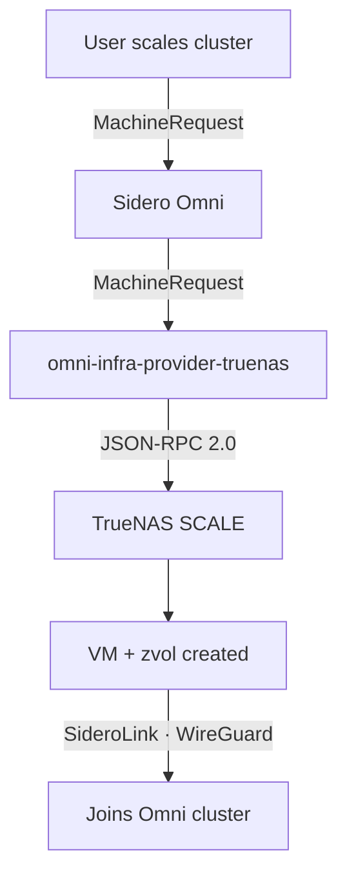

# omni-infra-provider-truenas

**Automatically provision and manage Talos Linux VMs on TrueNAS SCALE through [Sidero Omni](https://omni.siderolabs.com/).**

Turn your TrueNAS server into a fully automated Kubernetes platform — no Proxmox, no manual VM setup, no maintenance overhead.

## What is this?

An open-source infrastructure provider that bridges [Sidero Omni](https://omni.siderolabs.com/) and [TrueNAS SCALE](https://www.truenas.com/truenas-scale/). When you scale a Kubernetes cluster in Omni, this provider automatically creates a Talos Linux VM on TrueNAS — complete with ZFS-backed storage, network configuration, and automatic cluster enrollment. When machines are removed, it cleans everything up.

**Requires TrueNAS SCALE 25.04+ (Fangtooth).** Uses the JSON-RPC 2.0 API exclusively.

## Key Features

- **Zero-touch VM lifecycle** — provision, start, stop, and destroy VMs automatically
- **Multi-disk VMs** — additional data disks with per-disk pool and encryption options
- **Deterministic MACs** — stable MAC addresses survive reprovision, so DHCP reservations persist
- **ZFS-native storage** — zvols for VM disks, per-zvol encryption, SHA-256 deduplicated ISO caching
- **Flexible networking** — bridges, VLANs, multi-NIC, jumbo frames (MTU 9000)
- **Self-healing** — auto-replace VMs stuck in ERROR state after configurable recovery attempts
- **WebSocket JSON-RPC 2.0** — authenticated WebSocket connection with TrueNAS API key
- **Observability** — OpenTelemetry traces, Prometheus metrics, Grafana dashboards, Pyroscope profiling

## How It Works



1. **Omni creates a MachineRequest** — user scales a cluster or creates a MachineSet
2. **Provider generates a Talos schematic** — OS image with default extensions (qemu-guest-agent, util-linux-tools, iscsi-tools)
3. **Provider downloads the Talos ISO** — from Image Factory, cached on TrueNAS
4. **Provider creates a VM** — zvol for disk, CDROM with ISO, NIC on your bridge
5. **VM boots Talos, joins Omni** — via SideroLink (outbound WireGuard tunnel)

## Quick Links

<div class="grid cards" markdown>

- :material-rocket-launch: **[Getting Started](getting-started.md)** — From NAS to running cluster, no experience required
- :material-cog: **[Quick Start](quickstart.md)** — Configuration reference and deployment options
- :material-nas: **[TrueNAS Setup](truenas-setup.md)** — Step-by-step NFS, iSCSI, SSH, bridges, and jumbo frames
- :material-lan: **[Networking](networking.md)** — Bridges, DHCP, MetalLB, VIP, router-specific guides
- :material-harddisk: **[Storage](storage.md)** — CSI options: NFS, iSCSI, democratic-csi, Longhorn
- :material-resize: **[Sizing Control Planes](sizing.md)** — When and how to make CP nodes bigger
- :material-wrench: **[Troubleshooting](troubleshooting.md)** — Common issues and solutions

</div>

## Installation

=== "Docker Compose on TrueNAS (Recommended)"

    Run the container directly on your TrueNAS host via **Apps > Discover > Install via YAML**. Create an API key first at **Credentials > Local Users > root > API Keys**.

    ```yaml
    services:
      omni-infra-provider-truenas:
        image: ghcr.io/bearbinary/omni-infra-provider-truenas:latest
        restart: unless-stopped
        network_mode: host
        environment:
          OMNI_ENDPOINT: "https://omni.example.com"
          OMNI_SERVICE_ACCOUNT_KEY: "<your-key>"
          TRUENAS_HOST: "localhost"
          TRUENAS_API_KEY: "<truenas-api-key>"
          TRUENAS_INSECURE_SKIP_VERIFY: "true"
          DEFAULT_POOL: "default"
          DEFAULT_NETWORK_INTERFACE: "br0"
    ```

=== "Kubernetes (Helm)"

    ```bash
    helm install omni-infra-provider deploy/helm/omni-infra-provider-truenas \
      --namespace omni-infra-provider --create-namespace \
      --set omniEndpoint="https://omni.example.com" \
      --set truenasHost="truenas.local" \
      --set secrets.omniServiceAccountKey="<your-key>" \
      --set secrets.truenasApiKey="<your-api-key>"
    ```

=== "Docker Compose (Remote)"

    ```bash
    cp .env.example .env
    # Fill in OMNI_ENDPOINT, OMNI_SERVICE_ACCOUNT_KEY, TRUENAS_HOST, TRUENAS_API_KEY
    docker compose -f deploy/docker-compose.yaml up -d
    ```

## Common Questions

**How do I run Kubernetes on TrueNAS?**
:   Install this provider, connect it to Sidero Omni, and define MachineClasses with CPU, memory, and disk specs. The provider handles VM creation, Talos boot, and cluster enrollment automatically.

**Does TrueNAS support Kubernetes natively?**
:   TrueNAS SCALE 25.04+ removed built-in Kubernetes. This provider restores that capability via Sidero Omni and Talos Linux VMs.

**Can I use this instead of Proxmox?**
:   Yes. With this provider and Sidero Omni, TrueNAS SCALE becomes a fully automated Kubernetes infrastructure platform with ZFS-backed storage — no Proxmox needed.

**What are the minimum requirements?**
:   TrueNAS SCALE 25.04+, ~4 CPU cores, 16 GB RAM, and 50 GB free disk for a single-node cluster. See the [Getting Started guide](getting-started.md) for full sizing.
