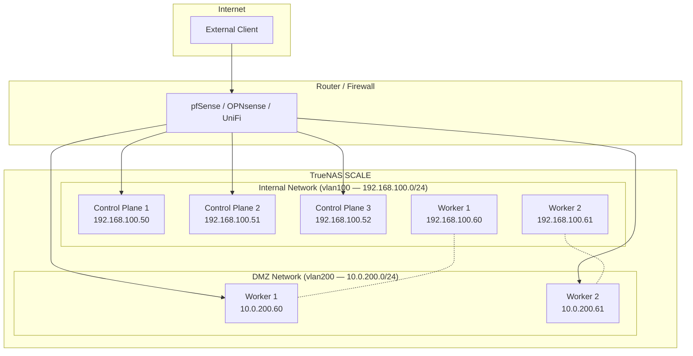

# Multi-Homing Guide

Network segmentation for TrueNAS-hosted Kubernetes clusters using multiple NICs. This guide walks through a common pattern: separating internal cluster traffic from a DMZ-facing ingress using Traefik.

---

## Why Multi-Home?

A single-NIC cluster puts all traffic on one network — cluster control plane, inter-node communication, and external-facing services share the same subnet. Multi-homing lets you:

- **Isolate ingress traffic** — DMZ-facing services (Traefik, Nginx) get a dedicated NIC on a separate subnet
- **Separate storage traffic** — iSCSI/NFS traffic on a dedicated high-throughput network
- **Enforce network policies** — firewall rules per subnet at the router level
- **Reduce blast radius** — a compromised ingress pod can't reach internal cluster IPs directly

---

## Architecture



- **vlan100 (Internal)** — etcd, kubelet, inter-node communication, Omni SideroLink. Not routable from the internet.
- **vlan200 (DMZ)** — Traefik ingress only. Firewall allows inbound HTTP/HTTPS from the internet, nothing else.
- Workers have NICs on both networks. Control planes only need the internal network.

---

## MachineClass Configuration

### Control Planes (internal only)

```yaml
cpus: 2
memory: 4096
disk_size: 40
pool: default
network_interface: vlan100
```

### Workers (internal + DMZ)

```yaml
cpus: 4
memory: 8192
disk_size: 100
pool: default
network_interface: vlan100
advertised_subnets: "192.168.100.0/24"
additional_nics:
  - network_interface: vlan200
    type: VIRTIO
```

The `advertised_subnets` field pins etcd and kubelet to the internal network (`vlan100`). Without it, Kubernetes might try to use the DMZ interface for cluster communication, which would fail or create a split-brain.

> **Note:** If you omit `advertised_subnets`, the provider auto-detects the primary NIC's subnet from TrueNAS and applies it automatically.

---

## Additional-NIC Configuration (v0.16.1+)

Each entry in `additional_nics[]` supports these fields:

| Field | Type | Default | Purpose |
|---|---|---|---|
| `network_interface` | string (required) | — | Host bridge, VLAN, or physical interface |
| `type` | string | `VIRTIO` | NIC model (`VIRTIO` or `E1000`) |
| `mtu` | integer | host default | 576–9216, e.g. `9000` for jumbo frames |
| `dhcp` | boolean | `true` | Run DHCPv4 on this NIC; set `false` to attach without autoconfig |

> **No static addresses or gateway fields — by design.** A MachineClass is
> shared across every worker in a MachineSet, so any static IP placed here
> would be claimed by N workers simultaneously and collide. The sanctioned
> way to pin a worker to a known IP is a **DHCP reservation on the upstream
> router**, keyed off the NIC's deterministic MAC (which the provider logs
> at VM creation). Reservations survive reprovision because the MAC is
> derived from the machine request ID.

### DHCP on a second segment (the golden path)

```yaml
additional_nics:
  - network_interface: vlan200
    # dhcp defaults to true; DHCPv4 lease picked up on vlan200
```

### Jumbo-frame storage network

```yaml
additional_nics:
  - network_interface: vlan300
    mtu: 9000
```

### Off the golden path — attach without autoconfig

```yaml
additional_nics:
  - network_interface: vlan400
    dhcp: false   # advanced use: bond slave, VLAN parent, or manually-applied config patch
```

Set `dhcp: false` when the NIC will be configured by something else (a
bond driver, a VLAN trunk, or a per-node config patch you apply
separately). The link comes up with its deterministic MAC and no
Layer-3 config — ready for the downstream configuration to take over.

### Validation rules

- `additional_nics` max: **16 per VM** (TrueNAS practical ceiling).
- Every NIC must have a unique `network_interface` on the VM.
- `mtu` must be in `[576, 9216]` if set.

---

## DHCP Reservations

Set up static DHCP leases in your router for predictable IPs. All NICs use deterministic MAC addresses derived from the machine request ID, so DHCP reservations survive reprovision. The provider logs each NIC's MAC address at creation:

```
VM NIC MAC address (deterministic) — stable across reprovision for DHCP reservations
  mac=02:ab:cd:xx:xx:xx  vm_name=omni_talos_worker_1  network_interface=vlan100  role=primary
attached additional NIC  network_interface=vlan200  mac=02:ef:01:yy:yy:yy  vm_name=omni_talos_worker_1
```

| VM | vlan100 (Internal) | vlan200 (DMZ) |
|----|-------------------|---------------|
| cp-1 | 192.168.100.50 | — |
| cp-2 | 192.168.100.51 | — |
| cp-3 | 192.168.100.52 | — |
| worker-1 | 192.168.100.60 | 10.0.200.60 |
| worker-2 | 192.168.100.61 | 10.0.200.61 |

---

## Firewall Rules

On your router/firewall, create rules for the DMZ subnet:

| Direction | Source | Destination | Ports | Action |
|-----------|--------|-------------|-------|--------|
| Inbound | Any | 10.0.200.0/24 | 80, 443 | Allow |
| Inbound | Any | 10.0.200.0/24 | * | Deny |
| Outbound | 10.0.200.0/24 | 192.168.100.0/24 | * | Deny |
| Outbound | 10.0.200.0/24 | Any | 80, 443 | Allow |

This ensures:
- External traffic can reach Traefik on ports 80/443
- DMZ cannot initiate connections to the internal network
- DMZ can make outbound HTTPS calls (for webhooks, API calls, etc.)

---

## Traefik Deployment

Deploy Traefik as a DaemonSet on worker nodes, bound to the DMZ interface. This uses MetalLB to assign a LoadBalancer IP from the DMZ subnet.

### MetalLB Configuration

First, configure MetalLB with an IP pool from the DMZ subnet. Apply this as an Omni cluster config patch or directly via `kubectl`:

```yaml
apiVersion: metallb.io/v1beta1
kind: IPAddressPool
metadata:
  name: dmz-pool
  namespace: metallb-system
spec:
  addresses:
    - 10.0.200.100-10.0.200.150
---
apiVersion: metallb.io/v1beta1
kind: L2Advertisement
metadata:
  name: dmz-l2
  namespace: metallb-system
spec:
  ipAddressPools:
    - dmz-pool
  interfaces:
    - eth1  # The DMZ interface inside Talos
```

> **Finding the interface name:** Talos names interfaces `eth0`, `eth1`, etc. in the order they appear. The primary NIC (vlan100) is `eth0`, the DMZ NIC (vlan200) is `eth1`. Verify with `talosctl get addresses` on a worker node.

### Traefik Helm Values

```yaml
deployment:
  kind: DaemonSet

nodeSelector:
  # Only schedule on workers (which have the DMZ NIC)
  node-role.kubernetes.io/worker: ""

service:
  type: LoadBalancer
  annotations:
    metallb.universe.tf/address-pool: dmz-pool

ports:
  web:
    port: 8000
    exposedPort: 80
    protocol: TCP
  websecure:
    port: 8443
    exposedPort: 443
    protocol: TCP

# Traefik binds to all interfaces by default.
# Incoming traffic arrives via MetalLB on the DMZ IP.
# Internal services are reached via the internal network.
```

Install with Helm:

```bash
helm repo add traefik https://traefik.github.io/charts
helm install traefik traefik/traefik -n traefik --create-namespace -f traefik-values.yaml
```

### DNS Configuration

Point your public DNS to the MetalLB DMZ IP:

```
*.apps.example.com  →  10.0.200.100
```

On your router, NAT/port-forward ports 80 and 443 from your WAN IP to `10.0.200.100`.

---

## Verifying the Setup

1. **Check NICs inside Talos:**
   ```bash
   talosctl -n 192.168.100.60 get addresses
   ```
   You should see IPs on both `eth0` (internal) and `eth1` (DMZ).

2. **Check etcd is on the internal network:**
   ```bash
   talosctl -n 192.168.100.50 get etcdmembers
   ```
   All etcd peer URLs should use `192.168.100.x` addresses, not `10.0.200.x`.

3. **Check Traefik is listening on DMZ:**
   ```bash
   kubectl get svc -n traefik
   ```
   The `EXTERNAL-IP` should be from the DMZ pool (e.g., `10.0.200.100`).

4. **Test end-to-end:**
   ```bash
   curl -H "Host: test.apps.example.com" http://10.0.200.100
   ```

---

## Variations

### Storage Network (3 NICs)

Add a third NIC for dedicated NFS/iSCSI storage traffic:

```yaml
network_interface: vlan100
advertised_subnets: "192.168.100.0/24"
additional_nics:
  - network_interface: vlan200    # DMZ
    type: VIRTIO
  - network_interface: vlan300    # Storage (MTU 9000 on switch)
    type: VIRTIO
```

### Dual-Stack (IPv4 + IPv6)

If your DMZ subnet has IPv6, include both CIDRs:

```yaml
advertised_subnets: "192.168.100.0/24,fd00:100::/64"
```

This pins etcd and kubelet to the internal network for both address families.
