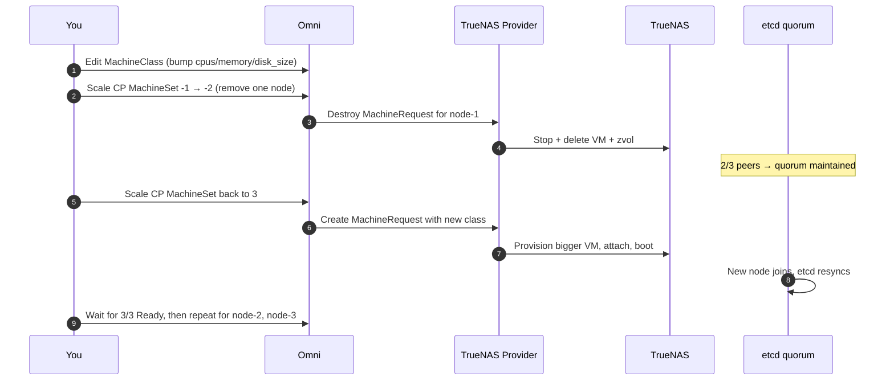

# Sizing Control Plane Nodes

The default MachineClass in [Getting Started](getting-started.md) ships a
**2 vCPU / 2 GiB RAM / 10 GiB disk** control plane. That's fine for a homelab
with a handful of workloads. It is **not** fine once the cluster starts doing
real work.

This page covers:

- [Why control planes run out of room](#what-makes-a-control-plane-bigger)
- [Observable triggers — how to tell *right now* that yours is too small](#triggers-scale-up-when)
- [Sizing table by cluster scale](#sizing-table)
- [How to actually resize a Talos control plane safely](#how-to-resize)

!!! tip "TL;DR"
    Scale up the control plane when the apiserver is slow, etcd is warning
    about slow disk, or the CP VM is OOMKilling. Everything else is
    premature optimization.

## What Makes a Control Plane Bigger

Four things drive control plane resource consumption. Knowing which one is
hurting you tells you *what* to bump — CPU, RAM, disk, or all three.

| Driver | Hits | Bump |
|---|---|---|
| **Cluster size (node count)** | etcd heartbeat volume, apiserver watch fan-out | CPU + RAM |
| **Pod / object count** | etcd DB size, apiserver list/watch memory | RAM + disk |
| **API churn** (CI/CD, GitOps, operators) | apiserver CPU, etcd write IOPS | CPU |
| **CRD / operator load** (Argo, Rancher, Crossplane, cert-manager) | etcd objects, controller-manager CPU | CPU + RAM |

A 3-node cluster running a static app looks nothing like a 3-node cluster
running ArgoCD + Prometheus + cert-manager + 40 CRDs. The node count is the
same; the second one needs a bigger control plane.

## Triggers — Scale Up When

Don't guess. Watch for one of these concrete signals.

### 1. `kubectl top` shows CP pressure

```bash
kubectl top node -l node-role.kubernetes.io/control-plane=
```

- **CPU consistently > 70%** under normal load → bump `cpus`.
- **Memory consistently > 70%** or creeping upward over days → bump `memory`.

One spike during an operator reconcile storm is fine. A sustained floor is not.

### 2. kube-apiserver p99 latency is high

From an in-cluster Prometheus or the Omni dashboard:

```promql
histogram_quantile(0.99,
  sum by (le, resource, verb) (
    rate(apiserver_request_duration_seconds_bucket{verb!="WATCH"}[5m])
  )
)
```

- **p99 > 1s on `GET` / `LIST`** for common resources (pods, configmaps) →
  apiserver is CPU-starved or etcd is slow. Bump CPU first, then look at
  etcd disk.

### 3. etcd is warning about slow writes

Check etcd logs on the control plane via Omni:

```bash
omnictl --cluster <name> talosctl logs etcd | grep -iE "took too long|slow"
```

Signals:

- **`apply request took too long`** (> 100 ms) → etcd disk fsync is slow. Root
  cause is usually the ZFS pool, not CPU. See [ZFS considerations](#zfs-and-etcd-disk-performance)
  below. Bumping CP CPU/RAM will *not* fix this.
- **`slow fdatasync`** → same story. The zvol needs a faster vdev layout.
- **`request stats`** showing leader changes / elections during normal
  operation → CP CPU contention. Bump `cpus`.

### 4. kube-apiserver is OOMKilling

```bash
omnictl --cluster <name> talosctl dmesg | grep -i oom
# or
kubectl describe pod -n kube-system kube-apiserver-<node> | grep -i killed
```

**Bump `memory` immediately.** apiserver OOM kills cause cluster-wide API
outages while kubelet restarts it. If you hit this once, double the memory
and move on.

### 5. etcd DB is filling up

```bash
# Via Omni talosctl:
omnictl --cluster <name> talosctl -n <cp-node> \
  service etcd status
```

Or from a control plane node (via Omni shell):

```bash
etcdctl --endpoints=https://127.0.0.1:2379 \
  --cert=/system/secrets/kubernetes/etcd/peer.crt \
  --key=/system/secrets/kubernetes/etcd/peer.key \
  --cacert=/system/secrets/kubernetes/etcd/ca.crt \
  endpoint status -w table
```

- **DB size > 2 GiB** → bump `memory` to 8 GiB+. etcd keeps the working set
  in RAM.
- **DB size approaching `disk_size - 20 GiB`** → bump `disk_size`. etcd
  enforces a 2 GiB default quota unless you raised it, but Talos system
  disk also stores logs, images, and workload ephemeral storage.

### 6. Adding a heavy operator

Installing one of these is a deliberate "bump first, install second" moment:

- **Argo CD / Argo Workflows** — frequent reconciles, many `Application` CRs.
- **Rancher / Fleet** — continuous cluster-wide watches.
- **Crossplane** — many providers, each adds CRDs and controllers.
- **Prometheus Operator** at full mesh-monitoring scale.
- **Istio / Linkerd / Cilium with many `CiliumNetworkPolicy` objects**.

Don't wait for the pain. Double the control plane size *before* installing,
measure, then dial back if you over-shot.

## Sizing Table

These are starting points, not hard rules. Calibrate against the triggers above.

| Scenario | Nodes | Pods (approx) | vCPU | RAM | Disk |
|---|---|---|---|---|---|
| **Homelab — single CP, static workloads** | 1–3 | < 50 | 2 | 2 GiB | 20 GiB |
| **Small prod — 1 or 3 CP, light apps** | 3–10 | < 200 | 2–4 | 4–8 GiB | 40 GiB |
| **Medium — 3 CP, operators, CI/CD** | 10–25 | < 500 | 4 | 8–16 GiB | 80 GiB |
| **Large — 3 CP, GitOps + service mesh** | 25–50 | < 1500 | 4–8 | 16–24 GiB | 100 GiB |
| **Big — dedicated platform team** | 50+ | 1500+ | 8+ | 24+ GiB | 200 GiB+ |

**Rules of thumb worth knowing:**

- **HA CP = odd number (1, 3, 5).** 3 is the standard. 5 only if you expect
  simultaneous failures. etcd writes are synchronous to a majority — more
  peers means *more* write latency, not less.
- **All CP nodes in a cluster should be the same size.** etcd assumes peers
  are symmetric. Mixing a 4 GiB and a 16 GiB CP means the 4 GiB one becomes
  the bottleneck.
- **Memory > CPU, usually.** Running out of memory OOMs apiserver. Running
  out of CPU just makes things slow. Budget for memory first.

## How to Resize

Talos Linux is **immutable and replaceable**, not mutable. The canonical way
to "resize" a control plane is to *replace* the nodes — the VM provider treats
this as normal lifecycle. etcd quorum survives single-node replacements in a
3-node HA CP.

### Option A — Edit the MachineClass and roll nodes (HA, 3+ CP)

This is the safe path if you have an HA control plane.



1. Edit the MachineClass in Omni (UI or `omnictl apply`) — bump `cpus`,
   `memory`, `disk_size`.
2. In the Omni UI: cordon and drain one CP node, then delete it from the
   MachineSet. The provider destroys its VM and zvol.
3. Scale the MachineSet back up by 1. The provider provisions a new VM at
   the new size. It joins etcd and resyncs.
4. Wait for all 3 CP nodes to report Ready. **This can take a few minutes
   per node** while etcd resyncs.
5. Repeat for the remaining two nodes, one at a time.

**Never delete more than one CP node at a time.** Losing 2 of 3 means losing
quorum; the cluster goes read-only until a peer is restored.

### Option B — Single CP with downtime (homelab)

If you only have one control plane, there is no quorum to preserve — you're
going to have downtime regardless. Two paths:

**B1. Replace via Omni (recommended)** — same flow as Option A, but the
cluster API is unavailable while the new CP provisions (typically 2–5
minutes).

**B2. In-place on TrueNAS (fast but ZFS-only expansion)** — works for bumping
CPU and memory; disk growth needs Talos cooperation:

```bash
# Stop the VM on TrueNAS
midclt call vm.stop <VM_ID>

# Bump CPU and memory (immediate, no Talos change needed)
midclt call vm.update <VM_ID> '{"vcpus": 4, "memory": 8192}'

# To grow the root disk: expand the zvol, then Talos auto-extends the partition
zfs set volsize=40G <pool>/omni-vms/<request-id>

# Start the VM
midclt call vm.start <VM_ID>
```

Disk *shrinking* is never supported. Only grow.

In-place edits bypass Omni's record of intended size. Next provisioner
reconcile won't "fix" it (the provider doesn't reshape existing VMs), but
if Omni ever reprovisions that VM — through a Talos upgrade failure,
healthcheck reset, or manual destroy — you'll get back the MachineClass-sized
VM. Prefer Option B1 unless you're sure.

### ZFS and etcd Disk Performance

etcd is the single most latency-sensitive component in Kubernetes. It does
synchronous `fdatasync` on every write.

If `etcd slow fsync` warnings are your trigger, **bumping vCPU / RAM will
not help.** You need a faster storage path:

- **Add an SLOG / ZIL vdev** to the pool backing CP zvols. A small NVMe SSD
  as SLOG turns ZFS's sync writes from "wait for the spinning disk" into
  "wait for the NVMe". This is the highest-impact single change.
- **Move the CP zvols onto an all-NVMe pool.** If your main pool is HDDs
  with no SLOG, consider creating a small NVMe pool just for control plane
  and etcd-heavy workloads, and pointing the CP MachineClass at that pool
  via its `pool` field.
- **Disable `sync=disabled` for the CP zvol.** *Don't.* etcd relies on
  durable writes; disabling sync risks corrupted cluster state on power
  loss.

See [Storage Guide](storage.md) for pool layout trade-offs.

## See Also

- [Getting Started](getting-started.md) — initial sizing for first clusters
- [Quick Start](quickstart.md) — MachineClass field reference
- [Storage Guide](storage.md) — pool / SLOG / NVMe considerations
- [Troubleshooting](troubleshooting.md) — when sizing isn't the fix
